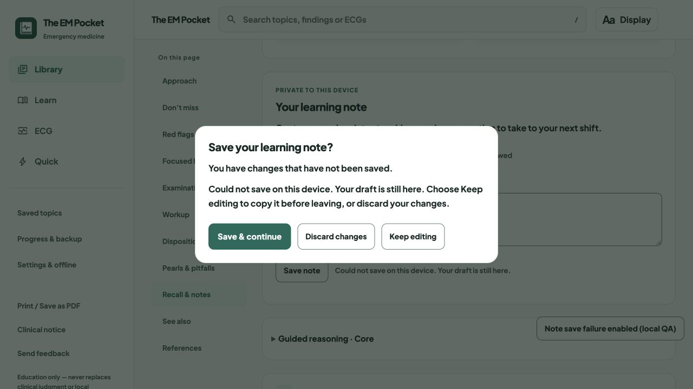
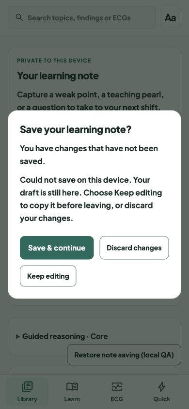

# Preserve note drafts when device storage fails

Release: `20261008-note-save-guard-v40` · scoped service-worker cache `v238`.

Previously, a failed note write still marked the editor clean, and **Save & continue** closed its dialog and navigated away. Refreshing could then lose the new text. Failed writes also replaced the session copy of the previous note, so discarding changes did not reliably restore the saved version.

Saving now reports success only after the device write succeeds. A failed save keeps the draft, the unsaved-change guard and the current route intact, with an accessible error inside the dialog. Discard restores the previous saved note. A later retry can succeed after a temporary write failure; if the original records cannot be read, the app does not overwrite them with an incomplete record. Both presentation notes and ECG guide notes use the same save path and the existing free storage key.

Validation:

- `node --test tests/*.test.js`: 211 passed, no failures or skips.
- Browser regressions cover manual failure, Save & continue, refresh protection, Keep editing, Discard, existing-note preservation and retry after recovery for both note editors.
- Persistence tests cover failed writes and deletions, recovery without losing other learning records, and blocked reads.
- Local in-app browser review at desktop 1280 × 720 and phone 390 × 844, with a temporary fault-injection fixture. The fixture kept learning-record writes in memory, leaving real device learning records untouched, and was removed after review.
- Syntax and diff checks passed. No physical-device testing was performed.

