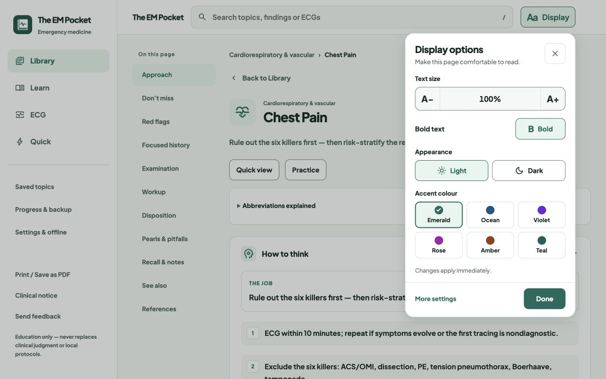
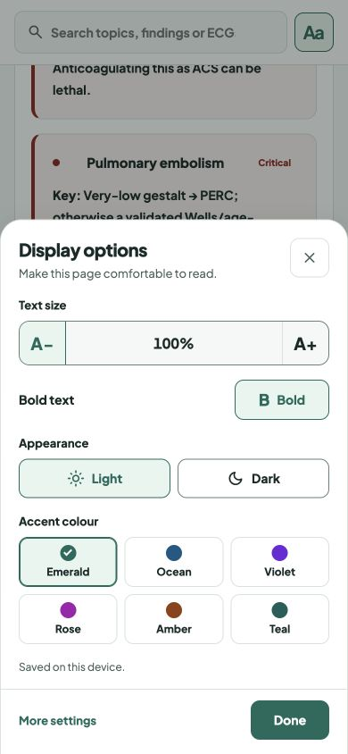
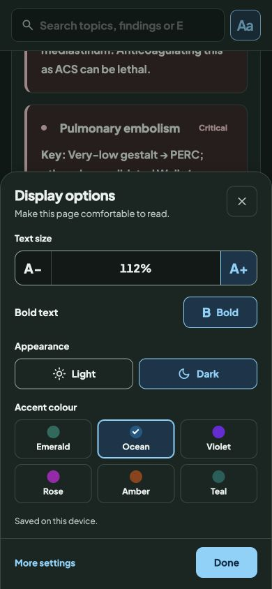
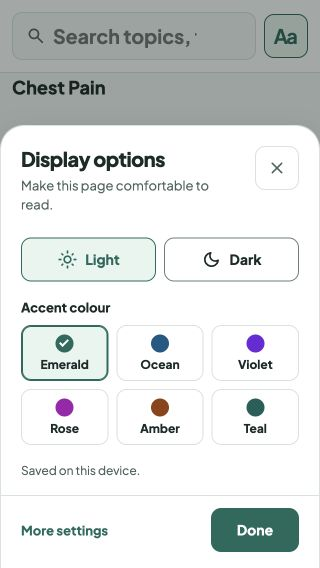

# Display options without leaving the reader

Release: `20261008-reading-panel-v37` · scoped service-worker cache `v234`.

The top-bar **Aa / Display** action opens a native modal over the current page: a right-aligned panel on desktop and a bottom sheet on mobile. Text size, bold text, light/dark appearance and six labelled accent colours apply immediately. The page and any learning-note draft remain mounted, and the visible reading line is kept in place as text reflows.

Close, Done, Escape and the backdrop dismiss the panel. Keyboard focus stays inside while it is open and returns to its opener on dismissal. Small screens scroll inside the panel with the close button kept visible. Route changes and printing release the modal. The preferences remain in the existing free `em-cps-prefs` record; failed storage writes are reported as session-only changes.

General Settings retains offline access, installation, learning-record tools and app information, with a link to the same display panel. Its explicit return button restores the previous route, section and scroll position. Visiting this utility page preserves the reader's original Back destination.

## Validation

- `node --test tests/*.test.js`: 205 passed, no failures or skips.
- Added browser regressions for in-place display changes, unsaved notes, reading-line stability, modal dismissal/focus, small-screen reachability and Settings return context.
- Local in-app browser review: desktop 1280 × 800, phone 390 × 844 and short phone 320 × 568; light/dark themes, colour changes, 140% text, scrolling and return navigation.
- Syntax checks and `git diff --check` passed. The pinned Material Symbols refresh tool still runs successfully after the shell changes.
- Browser viewport checks are not physical-device testing.

## Captures

