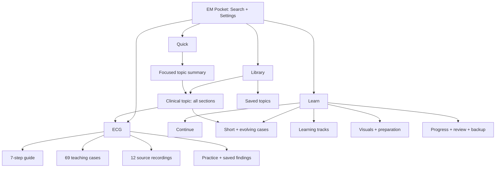

# EM Pocket — المخطط الشامل لإعادة التصميم

وثيقة تصميم منتج وتجربة استخدام ونظام واجهة وخطة تنفيذ واختبار. الإصدار 1.0، بتاريخ 8 أكتوبر 2026.

**الحالة:** مواصفة التصميم الأصلية. نُفذت إعادة التصميم في الإصدار `20261008-redesign-v31`؛ تفاصيل ما نُفذ ونتائج اختباره وحدوده في [تقرير التنفيذ والتحقق](IMPLEMENTATION-VERIFICATION.md). الأرقام الزمنية وميزانيات الأداء أدناه أهداف للاختبار، وليست نتائج محققة أو وعودًا بالاستبقاء. جميع الأمثلة البصرية تخطيط عرض، وليست إرشادات علاجية جديدة.

**خط الأساس:** التطبيق المجاني EM-CPs، commit `545162d`، إصدار الأصول `20261008-clinical-v30`، service worker `v225`. الجرد مستخرج من المصدر الحالي، ويُحدّث قبل بدء التنفيذ إذا تغير المصدر. توضع هذه الوثائق خارج حزمة النشر التشغيلية.

## 01 — قرار المنتج والنتيجة المطلوبة

المنتج مرجع تعليمي في طب الطوارئ، يتيح الوصول السريع إلى الموضوع والمعلومة، ثم الانتقال الاختياري إلى تعلم نشط مترابط. يخدم القارئ الذي يريد معلومة محددة والمتعلم الذي يريد جلسة متسلسلة. لا يُطلب منه اختيار شخصية أو مستوى أو إكمال ملف تعريفي ليفتح المحتوى.

النتيجة المرئية: هيكل واحد، أربع وجهات رئيسية، بحث دائم الوصول، قراءة هادئة، تعليم له بداية ونهاية واستئناف، وتخطيط قلب يحتل المساحة المناسبة له. تظل الهوية الطبية التعليمية صريحة. لا تعني مشاهدة المحتوى أو إكمال حالة امتلاك كفاءة سريرية.

قرارات محسومة في هذه المواصفة:

- الوجهات الأساسية بالترتيب: **Library / Learn / ECG / Quick**. الأسماء العربية التوضيحية: المكتبة / التعلم / تخطيط القلب / العرض السريع.
- الوجهة الافتراضية الجديدة **Library**؛ لا تسبقها لوحة إحصائيات أو مسار إلزامي. روابط المحتوى المباشرة تتجاوز الوجهة الافتراضية وتفتح مقصودها.
- يحتفظ المنتج باسم EM Pocket وبالأخضر الحالي أساسًا للهوية. لا نغيّر الهوية إلى الأزرق لمجرد التجديد.
- محتوى التطبيق الحالي إنجليزي. هذه الوثيقة عربية؛ لا تعني ترجمة المحتوى الطبي تلقائيًا. يُهيأ النظام لـ RTL مع إبقاء محتوى ECG والأرقام والوحدات في اتجاهها الصحيح.
- إعادة بناء قوالب العرض والتنقل تدريجيًا؛ محركات الإشارات والمحتوى الطبي والتخزين الحالي أصول نحافظ عليها ونربطها بواجهة جديدة.
- لا جدار دفع أو حساب أو اشتراك أو محتوى خارجي مطلوب للتشغيل. لا تعديل للتطبيق المدفوع المجاور.
- لا إدخال لجرعات أو حاسبات أو إرشادات علاجية جديدة ضمن تجميل الواجهة. أي إضافة محتوى لها مراجعة سريرية منفصلة.

## 02 — الجرد الذي يجب أن يبقى متاحًا

| المجال | الجرد الحالي | التزام إعادة التصميم |
|---|---:|---|
| المواضيع السريرية | 45 | وصول كامل إلى كل موضوع وكل حقل بلا إسقاط أو اختصار يغير المعنى |
| دليل ECG | 7 خطوات، 18 نمطًا | ترتيب تعلم واضح وروابط ثابتة إلى جميع الأقسام |
| مكتبة الرسوم داخل الدليل | 27 شكلًا | احتفاظ بالشرح والتفاعل وحدود كل شكل |
| حالات ECG الاصطناعية التفاعلية | 69 | عرض، تكبير، علامات، تفسير، مقارنة، ممارسة وتقدم |
| التسجيلات الحقيقية | 12 من PTB-XL | الحفاظ على العينات الأصلية والمصدر والمعايرة والوسوم وحدودها |
| الحالات القصيرة | 12 | اختيار، إجابة، تفسير البدائل، إعادة محاولة وتقييم ذاتي |
| الحالات المتطورة | 6 | المراحل، الاستئناف ضمن الجلسة، الاختيارات الأولى، المناقشة والمصادر |
| وحدات التحضير والمناقشة | 6 | القراءة والتأشير كقراءة؛ لا شهادة إتقان لإجراء |
| مساحات التعلم البصري | 5 | تسجيلات ECG، غازات الدم، رئة، صدر، أزواج ECG |
| التعلم الشخصي | قائم | مفضلة، ملاحظات، مراجعة مجدولة، ثقة ذاتية، تصدير واستيراد |
| أدوات المرجع | قائمة | تاريخ ومصادر، فلاتر، بحث، قوائم أعلام حمراء، ملخص قابل للنسخ، طباعة |
| PWA والتفضيلات | قائمة | تثبيت، تحديث، عمل محلي دون اتصال، حجم خط، غامق، لون، نهاري/ليلي |

قائمة كل معرف موجود ومكانه الجديد في الملحق [CONTENT-COVERAGE.md](CONTENT-COVERAGE.md). تُنشأ مصفوفة «قديم ← جديد ← اختبار قبول» قبل تبديل أي شاشة. لا يعتبر إخفاء ميزة في قائمة غير مكتشفة حفظًا لتجربتها.

## 03 — سيناريوهات الاستخدام المرجعية

| السيناريو | المسار المتوقع | معيار قبول المنتج المقترح |
|---|---|---|
| يريد مرجع ألم الصدر | بحث ← موضوع ← قسم مقصود | عنوان وموضوع واضحان؛ لا خطوة اختيار مستوى |
| يريد علامة خطر محددة | بحث شامل ← النتيجة ← قسم مفتوح | ظهور النص داخل سياقه وعدم إخفاء الشروط المصاحبة |
| يعود إلى حالة غير منتهية | Learn ← Continue ← المرحلة | لا تضيع الاختيارات الموجودة ولا يعاد ترتيبها عند العودة |
| يدرس ECG من البداية | ECG ← Guide ← خطوة ← مثال | مثال وشرح ورابط ممارسة متصل بالخطوة |
| يقرأ تسجيلًا حقيقيًا | ECG ← Recordings ← اختيار ← كشف الوسم | أصل التسجيل واضح؛ لا ادعاء تشخيص آني من وسم dataset |
| يستخدم الموضوع سريعًا | Quick ← اختيار موضوع | خطوات وتعليمات تصعيد كاملة ضمن نطاق الملخص المحدد |
| يستخدم التطبيق بلا شبكة | فتح نسخة سبق تجهيزها | shell وأصول أساسية متاحة؛ المصادر الخارجية معلمة بأنها تحتاج اتصالًا |
| يعود من صفحة نتيجة بحث | Back | نفس الاستعلام والفلاتر والموضع والعنصر المحدد |
| يستخدم قارئ شاشة/لوحة مفاتيح | التنقل والبحث والممارسة | اسم/دور/حالة، ترتيب تركيز منطقي، لا حاجز لوحة مفاتيح |
| يريد حفظ ملاحظة | موضوع ← Notes ← Save | حالة حفظ صادقة؛ تنبيه إن تعذر التخزين أو كانت هناك مسودة غير محفوظة |

يُختبر نجاح المهمة ونسبة الأخطاء والزمن الوسيط والنطاق، ولا يُفترض أن جميع المستخدمين ينجزونها خلال ثلاث ثوانٍ. لا تجمع بيانات سلوك مستمرة افتراضيًا؛ يمكن إجراء جلسات استخدام بموافقة المشاركين أو قياسات محلية مؤقتة بلا بيانات مرضى.

## 04 — هندسة المعلومات



- Library تضم فهرس المواضيع، التصفية، المفضلة، والموضوع الكامل.
- Learn هي وجهة التعلم والاستئناف؛ لا تعيد عرض جميع بطاقات المكتبة. تجمع أنواع التعلم تحت أسماء مفهومة دون فرض دمج محركاتها البرمجية.
- ECG وجهة واحدة تضم Guide / Cases / Recordings / Practice. تبقى هوية النموذج الاصطناعي والتسجيل الحقيقي مميزة في كل شاشة.
- Quick اختصار مرجعي تعليمي، لا واجهة فرز طبي ولا أداة قرار فردي. تعرض المواضيع نفسها بصياغة عرض مختلفة مع الوصول إلى الأصل.
- Settings وجهة ثانوية عبر زر ثابت. تضم القراءة والمظهر والتثبيت وحالة النسخة والخصوصية والمساعدة. التقدم والنسخ الاحتياطي لهما رابط منها، لكن موطنهما Learn.
- البحث عام. الفلاتر داخل Library أو قائمة Cases محلية ولا تتحكم في نتائج وجهات أخرى خفية.

## 05 — المسارات القديمة والجديدة

المسارات التالية مقترحة للإضافة. تبقى المسارات الحالية قابلة للفتح بعد التحديث، بما فيها روابط المفضلة واختصارات PWA والروابط المنسوخة. لا يعاد تخصيص معرف قديم لمعنى مختلف.

| الرابط/العائلة | السلوك الجديد |
|---|---|
| `#` أو فتح `./` | Library |
| `#library` | فهرس المكتبة الجديد |
| `#library~saved` | المواضيع المحفوظة |
| `#<topic-id>` | الموضوع نفسه بالقالب الجديد |
| `#<topic-id>~<section-id>` | الموضوع مع فتح القسم والتركيز على عنوانه |
| `#learn~home` | مركز التعلم |
| `#learn~practice` | الحالات المتطورة؛ رابط ثابت محفوظ |
| `#learn~case-<id>` | نفس الحالة المتطورة |
| `#learn~skills`, `#learn~module-<id>` | التحضير والوحدة نفسها |
| `#learn~visuals`, `#learn~visual-<id>` | مساحة التعلم البصري القديمة نفسها |
| `#learn~progress` | سجل التعلم والنسخ الاحتياطي |
| `#study`, `#study~<existing-tab>` | وجهات التعلم الحالية المكافئة، مع دعم جميع القيم الموجودة |
| `#study~case-<topic-id>` | الحالة القصيرة الصحيحة |
| `#study~due`, `#study~saved` | قائمة المراجعة والمحفوظات القديمة |
| `#ecg`, `#ecg~<existing-target>` | دليل ECG والقسم القديم؛ لا تحول `#ecg` إلى لوحة تسقط موضع الدليل |
| `#ecg-hub` | مدخل ECG الجامع الجديد |
| `#ecg-explorer`, `#ecg-explorer~<id>` | قائمة/حالة Explorer الحالية |
| `#ecg-explorer~practice` | ممارسة ECG الحالية |
| `#learn~visual-recordings` | التسجيلات الحقيقية نفسها؛ يظهر ECG نشطًا في التنقل العام |
| `#shift`, `#shift~<topic-id>` | Quick مع اختيار الموضوع المحفوظ أو المقصود |
| `#settings` | الإعدادات الجديدة |
| معرف/قسم مجهول | «This page is unavailable» مع العودة للوجهة المناسبة والبحث؛ لا شاشة بيضاء |

يُستخرج سجل كامل من router الحالي لاختبار القيم القديمة غير المذكورة فرديًا. التحويلات الداخلية تستخدم `replaceState` عند تطبيع الرابط، والتنقل المقصود يستخدم history جديدة. فتح قسم داخل الموضوع يدعم Back دون إنشاء history لكل حركة تمرير. يظل أصل التثبيت والمسار وscope كما هما.

## 06 — الغلاف العام وتوزيع المساحات

| النطاق | الهوامش | التنقل | تخطيط المحتوى |
|---|---:|---|---|
| 320–599px | 16px؛ 12px فقط للشاشات 320–359 | شريط علوي 56px + سفلي 64px وsafe-area | عمود واحد؛ أدوات الثانوية في sheets |
| 600–899px | 24px | شريط سفلي نفسه؛ العنوان/البحث أوسع | عمود قراءة واحد؛ قوائم قد تصبح عمودين إذا اتسع النص |
| 900–1199px | 24px | rail جانبي 80px؛ أسماء نصية ظاهرة/قابلة للكشف واسم متاح دائمًا | القراءة 720px كحد أقصى؛ نتائج أو بطاقات عمودان |
| ≥1200px | 32px | sidebar 248px قابل للتصغير إلى 80px | القراءة 760px؛ ECG/لوحات العمل حتى 1440px |
| ≥1600px و 4K | 32–48px | نفس الغلاف | لا تكبير تلقائي للنص أو تمديد أسطر القراءة إلى كامل الشاشة |

هذه نقاط بداية تصميمية؛ يتحول الغلاف عند الحاجة إلى المساحة، لا بناءً على اسم جهاز. إذا لم تتسع عناصر rail بعرض 900px مع تكبير النص، يستخدم نمط الهاتف مؤقتًا بدل الضغط والقص.

- عنصر تنقل رئيسي واحد ظاهر في كل حجم. لا تكرار لأربع وجهات في أعلى وأسفل الشاشة معًا.
- الشريط العلوي: اسم EM Pocket/عنوان الوجهة، بحث، إعدادات. داخل الموضوع يظهر Back بعنوان مقصده، ويختصر اسم المنتج عند ضيق المساحة.
- الشريط السفلي: أربع خانات متساوية، أيقونة 22px، نص 12–13px، مساحة لمس ≥48px؛ لا حركة ارتداد أو مؤشر متوهج.
- السفلي ثابت على أرضية شبه معتمة؛ لا تتضح موجة ECG أو نص عبره. احترام inset الجهاز ولوحة المفاتيح.
- المساحة السفلية للمحتوى = ارتفاع الشريط + safe-area + 24px. لا زر أو سطر أخير تحته.
- المفضلة/التقدم/الإعدادات وجهات ثانوية، فلا تضاف تبويبات عامة لها.
- حين تفتح لوحة المفاتيح لا يتحول الشريط إلى عنصر يزاحم نتائج البحث؛ تُستخدم حدود viewport الفعلية باختبار سلوكي.
- Back يعود إلى السياق المصدر: مكتبة/بحث/تعلم/Quick، وليس دائمًا إلى الصفحة الأولى.
- لا أكثر من صفين ثابتين أعلى القراءة؛ على الهاتف قد يُطوى البحث إلى زر أثناء قراءة الموضوع ويظل متاحًا بنقرة.

## 07 — نظام المسافات والأبعاد

| Token | قيمة أساسية | استخدام |
|---|---:|---|
| space-1 | 4px | بين الرمز والبيان القصير |
| space-2 | 8px | بين عناصر صغيرة |
| space-3 | 12px | صفوف أدوات ومحتوى مختصر |
| space-4 | 16px | حشو بطاقة هاتف |
| space-5 | 20px | عناصر قراءة مترابطة |
| space-6 | 24px | حشو بطاقة كبيرة/الفصل بين الأقسام |
| space-8 | 32px | بداية مجموعة جديدة |
| space-10 | 40px | فصل مناطق شاشة كبيرة |
| space-12 | 48px | فصل رئيسي استثنائي |
| control-height | 48px | زر أساسي وحقل بحث |
| compact-control-height | 44px | أداة ثانوية؛ ليس نص القراءة |
| radius-control | 10px | الحقول والأزرار |
| radius-card | 16px | بطاقة مستقلة |
| radius-dialog | 20px | نافذة/لوحة |
| border-width | 1px | حدود الهيكل |
| focus-width | 3px | مؤشر لوحة المفاتيح، offset 3px |

- لا تستخدم قيمًا عشوائية لحل كل شاشة؛ أي استثناء يذكر سببه ويضاف إلى token أو مكوّن محدد.
- ارتفاع البطاقة تابع للمحتوى، وليس ثابتًا. لا يقطع النص عند تغيير حجم الخط.
- نسب مرنة بـ rem للنص والحشو الذي يتأثر به. أبعاد ECG العلمية تبقى ضمن نظام الإحداثيات الخاص بالرسم.
- كثافة واحدة مريحة للهاتف. وضع Compact اختياري في Desktop للقوائم فقط، ولا يصغّر أهداف اللمس أو الإنذارات.

## 08 — الألوان والهوية الدلالية

القيم التالية مقترحة، وقد فُحص تباين أزواج النص/الخلفية المدرجة آليًا في [COLOR-CONTRAST.json](COLOR-CONTRAST.json). يجب إعادة التحقق على المكونات المركبة والشفافية والحالات عند التنفيذ. الحدود الزخرفية ليست بديلًا لحدود التحكم اللازمة للفهم.

| الدور | الخلفية النهارية | النص النهاري | الخلفية الليلية | النص الليلي |
|---|---|---|---|---|
| Canvas | `#F6F8F7` | `#172B28` | `#101917` | `#E9F1EE` |
| Surface | `#FFFFFF` | `#172B28` | `#182522` | `#E9F1EE` |
| Secondary text | `#FFFFFF` | `#4B635D` | `#182522` | `#B4C8C0` |
| Primary action | `#146B5C` | `#FFFFFF` | `#84D6BE` | `#10251E` |
| Selected soft | `#E8F5F0` | `#115544` | `#203D34` | `#B9EFDB` |
| Critical | `#FEF2F2` | `#991B1B` | `#3A1F24` | `#FFC7CE` |
| Warning | `#FFFBEB` | `#92400E` | `#352B19` | `#F8D59B` |
| Completed | `#ECFDF5` | `#166534` | `#1B3528` | `#B6E8C5` |
| Information | `#EFF6FF` | `#1E40AF` | `#1D2C43` | `#C2D8FF` |
| Error action | `#B91C1C` | `#FFFFFF` | `#FFC7CE` | `#3A1F24` |

- النص العادي ≥4.5:1؛ النص الكبير وفق تعريف WCAG ≥3:1؛ التحكم والمؤشرات المرئية اللازمة ≥3:1 مقابل المحيط ذي الصلة. الهدف الداخلي لنص القراءة الأساسي ≥7:1 حيث أمكن.
- أسماء الحالات والأزرار لا تعتمد على اختلاف اللون وحده. «Critical» يصاحبها نص ورمز تحذير، والصحيح/الخطأ لهما عبارة وسبب.
- اللون الأخضر يعني هوية أو نشاطًا مكتملًا بحسب السياق؛ لا يستخدم لإعلان أن مريضًا «آمن».
- ألوان الحالة الطبية مستقلة عن accent المستخدم. تبقى قيمة اختيار المستخدم القديمة محفوظة؛ يحوّل renderer الاختيار إلى زوج لوني مقروء دون تغيير معرفه.
- Emerald/Ocean/Violet/Rose/Amber/Teal تبقى اختيارات متاحة؛ يُختبر كل زوج نهاري/ليلي وحالات hover/focus/selected. اختيار Rose لا يُسوق بوصفه ذا تباين 4.5 مع الأحمر؛ لا توجد هذه النسبة بين القيم القديمة المقترحة.
- خلفية ECG وردية فاتحة ثابتة مقروءة، وخط الإشارة داكن، حتى في المظهر الليلي؛ أدوات المحيط ليلية. يقاس تباين الموجة والشبكة والوسوم على الورقة نفسها.
- لا تلوّن كل قسم أو بطاقة بلون جهاز مختلف. رمز صغير/عنوان نصي يكفي للتصنيف؛ اللون السريري أكثر بروزًا من لون الجهاز.

## 09 — الطباعة واللغة والرموز

| الدور | الهاتف | Desktop | line-height / weight |
|---|---:|---:|---|
| عنوان وجهة | 26px | 30px | 1.2 / 700 |
| عنوان موضوع | 24px | 28px | 1.25 / 700 |
| عنوان قسم | 20px | 22px | 1.35 / 650 أو وزن متاح |
| عنوان بطاقة | 17px | 18px | 1.4 / 650 |
| نص طبي أساسي | 16px | 17px | 1.65 / 400–500 |
| نص ثانوي | 14px | 14px | 1.5 / 400–500 |
| شارة/وسم | 12px | 12px | 1.4 / 600 |
| أرقام قياس | 14–16px | 14–16px | tabular-nums عند الحاجة |

- Plus Jakarta Sans المحلي للإنجليزية؛ system Arabic مناسب للنص العربي في المرحلة الأولى. إن اختير خط عربي إضافي يُرفق محليًا بترخيصه ويضاف إلى offline cache وميزانية الحجم.
- حجم القراءة الحالي محفوظ بخطوات 85/100/112/125/140%. يُختبر كذلك تكبير المتصفح إلى 200% وreflow عند 400% وفق المهمة.
- اختيار Bold محفوظ، ولا يحول كل النص إلى وزن 800. نص الجرعات والوحدات والعلامات الرياضية لا يتغير معناه أو يلتصق.
- أقصى طول سطر قراءة تقريبًا 65–75 حرفًا إنجليزيًا؛ يعاد ضبطه بصريًا للعربية دون تحويلها إلى معيار حروف ثابت.
- لا upper-case لفقرات أو عربية أو عناوين طويلة. تستخدم sentence case ثابتة.
- الأيقونات SVG محلية من عائلة واحدة، stroke 1.75–2، بقياس 20/24px. الاسم المرئي هو المرجع؛ emoji ليست أيقونات تشغيل أساسية.
- السهم يتبع اتجاه اللغة للتنقل فقط. موجة ECG ومحور الزمن والاشتقاقات والمصطلحات العلمية لا تعكس.
- مع RTL تستخدم logical properties و`bdi`/`dir=ltr` للوحدات والمعرفات. تبقى القراءة الإنجليزية الطبية LTR حتى لو كان chrome عربيًا.
- لا خط تحت لكل رابط داخل بطاقة؛ الروابط داخل النص مميزة بوضوح، والأزرار لها اسم فعل واضح.

## 10 — الحالات العامة لكل مكوّن

كل مكوّن تفاعلي يملك: default، hover عند وجود مؤشر، focus-visible، pressed، selected/expanded عند الحاجة، disabled بسبب معلوم، busy، success، error. لا ينشأ معنى جديد لكل حالة عبر اللون وحده.

| المكوّن | التصميم والسلوك المطلوب |
|---|---|
| Primary button | فعل رئيسي واحد لكل منطقة؛ ارتفاع 48px؛ نص قصير؛ busy يحافظ على العرض والاسم؛ يمنع تكرار عملية الحفظ/الاستيراد |
| Secondary button | surface وحد واضح؛ لا ينافس الأساسي؛ ارتفاع ≥44px |
| Icon button | مربع 44/48px؛ اسم متاح وtooltip لا يخفيه اللمس؛ disabled موضح |
| Text link | وجهة حقيقية بـ`a`؛ يدعم فتح تبويب ونسخ رابط؛ لا يستخدم زرًا مزيفًا للرابط |
| Topic card | عنوان، وصف موجز، تصنيف، حالة حفظ؛ رابط رئيسي واحد وزر حفظ مستقل بلا nesting تفاعلي |
| Learning card | نوع النشاط، عنوان، حالة، عدد المراحل إن معروف، فعل واحد؛ الوقت تقديري موسوم إن أضيف |
| Chip filter | نص + عدد إن مفيد؛ حالة اختيار متاحة؛ لا badge مضلل بأن العدد نتيجة اختبار إتقان |
| Search field | label دائم/متاح، placeholder مثال، clear، حالة نتائج؛ لا اعتماد على placeholder وحده |
| Select | native حين يكفي؛ لا قائمة مخصصة إلا لحاجة مثبتة؛ القيمة المختارة كاملة قابلة للقراءة |
| Checkbox | label قابل للنقر؛ مساحة ≥44px؛ نص بجانبه؛ لا خط شطب للمعلومة الطبية |
| Switch | نعم/لا حقيقيان فقط؛ الحالة مقروءة؛ لا يستعمل لاختيار من 3 خيارات |
| Accordion | button داخل heading، expanded/controls؛ فتح مستقل؛ لا طي تلقائي لقسم آخر |
| Segmented navigation | روابط إذا تغيرت الصفحة/المسار؛ ARIA tabs فقط إذا تبدلت panels داخل السياق نفسه |
| Progress | قيمة/إجمالي ووصف؛ عدد خطوات أو نشاط حقيقي؛ لا نسبة قراءة مشتقة من scroll |
| Tooltip | معلومة مساعدة فقط، تظهر keyboard/touch عند الحاجة؛ لا تحتوي شرطًا سريريًا أساسيًا |
| Popover/menu | anchoring ضمن الشاشة، Escape وخروج وتركيز عائد؛ لا hover فقط |
| Toast | رسالة حالة غير حرجة؛ 4–6 ثوانٍ؛ الإجراء المهم له بديل دائم؛ لا تسلسل يزعج القارئ |
| Inline alert | خطأ حفظ/أصل مفقود يبقى إلى حلّه؛ مع retry أو مسار واضح |
| Dialog/sheet | عنوان، وصف، زر إغلاق/خروج مناسب، focus محصور، scroll داخلي واحد، خلفية inert |
| Skeleton | للأصول غير المحملة فقط، قصير وبلا تذبذب مع reduced motion؛ لا شاشة تحميل مصطنعة للمحتوى المحلي |
| Empty state | سبب محدد + فعل مناسب؛ لا صورة تزيينية ضخمة ولا نهاية مسدودة |
| Error state | يصف ما تعذر، يحفظ العمل الحالي، يقدم retry/رجوع؛ لا يدعي نجاحًا |

## 11 — المكتبة: الشاشة الافتراضية

ترتيب العرض على الهاتف:

1. الشريط العلوي: EM Pocket، البحث، الإعدادات.
2. عنوان Library وسطر قصير يعرّف المحتوى؛ لا hero طويل ولا شعار كبير متكرر.
3. حقل بحث واضح «Search topics, findings or ECGs».
4. صف تصنيف أجهزة قابل للتمرير مع زر «Filters» وعدد الفلاتر المفعلة. الفلاتر الثانوية لا تتزاحم منذ البداية.
5. عدد النتائج واسم الفئة؛ زر Saved ثابت قابل للاكتشاف.
6. قائمة المواضيع؛ عنوان ووصف من سطرين كحد أقصى في الفهرس فقط، مع إتاحة الاسم الكامل عند الالتفاف. ليست قائمة تشخيصات مرضى.
7. رابط ثانوي «Start a learning session» إلى Learn؛ لا إدراج كل مسارات التعلم في الفهرس.

Desktop: البحث أعلى مساحة العمل، sidebar للوجهات، تصنيف الأجهزة في عمود/صف محلي بحسب العرض، بطاقات بعمودين أو ثلاثة إذا بقي الاسم مقروءًا. لا قائمة جانبية ثانية تعرض 45 موضوعًا دائمًا بجوار 45 بطاقة.

الفلاتر: الجهاز، سياق المريض الحالي في المصدر، مستوى أهمية التشخيصات داخل المرجع، والمحفوظ. يوضح الاسم أنها تصف **المحتوى**، لا تصنيف خطورة مريض. أسماء ومجموعات المصدر تحفظ؛ لا ينشأ ترشيح جديد يستبعد موضوعًا بلا مراجعة.

- البحث الشامل لا يتأثر بفلاتر مكتبة مخفية. داخل Library يمكن عرض scope مرئي «In these topics» فقط إذا اختاره المستخدم صراحة.
- اختيار عدة أجهزة: OR داخل المجموعة؛ المجموعات المختلفة AND. أي نموذج مختلف يكتب ويختبر قبل التنفيذ.
- Reset filters يمسح حالة التصفية الحالية فقط؛ لا يمسح المفضلة أو البحث الشامل أو التخزين.
- يحتفظ Back بموضع القائمة والفلاتر. لا يعاد ترتيب القائمة حسب التفاعل بصمت.
- الترتيب الافتراضي حسب مجموعات محتوى ثابتة ثم اسم الموضوع؛ Alphabetical اختيار واضح، وRecently opened قائمة ثانوية لا تتجاوز 6.
- حالة فارغة للمفضلة: «No saved topics yet» + رابط المكتبة، لا مطالبة بتسجيل دخول.

## 12 — البحث الشامل

يبحث محليًا في عناوين المواضيع، البدائل المعروفة، الأقسام، الأعلام الحمراء، history/exam/workup/disposition/pearls/pitfalls، خطوات وأنماط ECG، حالات Explorer، الحالات التعليمية والوحدات والوسائط. الروابط والمصادر تظل قابلة للوصول حتى إذا لم تدخل نصوصها كلها الفهرس.

التفاعل:

- على الهاتف يفتح سطح بحث كامل/شبه كامل مع Back وحقل واضح؛ Desktop panel تحت البحث بعرض مقروء، ويمكن توسيعه إلى شاشة نتائج.
- لا فتح تلقائي للوحة مفاتيح عند إغلاق التنبيه أو دخول موضوع. البحث يبدأ بفعل المستخدم.
- يبدأ التحديث بعد 120–150ms؛ لا يلزم Enter لإظهار اقتراحات. Enter يفتح النتيجة المحددة أو قائمة النتائج الكاملة.
- ترتيب التطابق: اسم/معرف دقيق، بادئة عنوان، مرادف مصادق عليه، ثم نص المحتوى. لا تستخدم خوارزمية غامضة لتقييم أولوية طبية.
- نتيجة واحدة: عنوان، اسم الموضوع/نوع النشاط، مقتطف واضح لا يقطع شرطًا مهمًا، اسم القسم. تمييز الكلمات بـmark مقروء في المظهرين.
- إظهار حتى 8 اقتراحات ثم «View all results». النتائج الكاملة تجمع بحسب النوع مع عدد ووسيلة تنقل بسيطة.
- ArrowDown/Up يتنقلان في الاقتراحات، Enter يفتح، Escape يغلق الاقتراحات ثم سطح البحث وفق الطبقة. التحكم لا يعمل أثناء كتابة IME composition.
- `aria-live` يعلن عدد النتائج باعتدال، لا كل ضغطة؛ لا استخدام combobox/listbox إلا بتطبيق عقده كاملًا.
- فتح النتيجة: يفتح القسم المطوي، يركز عنوانه، يبرز المقتطف لفترة قصيرة بدون تغيير النص، ويحفظ سياق الرجوع.
- صفر نتائج: الاستعلام ظاهر، Clear، اقتراحات إملائية من قاموس معروف، Browse library. لا اختراع إجابة سريرية.
- الفشل في بناء الفهرس: تظل المكتبة والتنقل متاحين، مع تنبيه محلي وإعادة محاولة.
- لا سجل بحث دائم افتراضيًا ولا إرسال الاستعلامات لخادم. لا بحث في الملاحظات الخاصة دون اختيار صريح مستقل.

## 13 — الموضوع السريري الكامل

الشاشة وحدة قراءة متصلة؛ أقسامها متاحة للقفز وليست عشرة تبويبات تختفي محتوياتها بالكامل. هذا يحافظ على البحث داخل الصفحة والطباعة والسياق الطبي.

ترتيب الشاشة:

1. Back مع المصدر، مسار تصنيف مختصر، عنوان الموضوع، الوصف، تاريخ مراجعة مصدر موضح النطاق.
2. أفعال: Save، Quick، More. More تضم Print/Copy link؛ الممارسة رابط واضح قرب منطقة التعلم.
3. Overview/Approach في بداية الصفحة، ثم شريط أقسام مختصر قابل للتمرير/قائمة Contents.
4. Don’t miss وRed flags مفتوحان افتراضيًا عند القراءة الجديدة؛ إظهار عنوانهما وتنبيههما غير معتمد على تبويب مخفي.
5. History، Exam، Workup، Disposition، Pearls & pitfalls.
6. Recall & notes، See also، References.

| حقل المصدر | طريقة العرض الجديدة | الاحتفاظ |
|---|---|---|
| name/tag/overview/meta | header ومقدمة موجزة | النص الدقيق، لا وعود مدة غير محسوبة |
| approach | خطوات مرقمة كاملة؛ إبراز أول مجموعة بلا حذف البقية | ترتيب وقيود المصدر |
| dontMiss | صف/بطاقة: الاسم + مستوى وصف المحتوى + السبب | لا قص الوصف الطبي |
| redFlags | قائمة نصية واضحة مع checklist اختيارية للمراجعة التعليمية | الاختيار لا يعني وجود العلامة لدى مريض ولا يحسب خطورة |
| history | مجموعات أسئلة/قرائن بعناوين قصيرة | كل بند محفوظ |
| exam | مجموعات فحص مستقلة | كل بند محفوظ |
| workup | عنوان مجموعة + بنود؛ جدول فقط إن كان علاقة صفوف/أعمدة | لا إسقاط المجموعة التالية في الملخص |
| disposition | صف لكل مسار + شروطه وحدوده | لا دمج يزيل استثناءات أو تحذيرات |
| pearls/pitfalls | فصل واضح؛ pitfalls مرئية عند القفز إليها | التفريق بين معلومة وتوصية |
| refs/evidence | مصادر أصلية وتاريخ تحقق وحدود المراجعة | الروابط واسم الوثيقة وتاريخها لا تاريخ واجهة مزيف |

- عرض كل الأقسام / طي الأقسام الثانوية أداة اختيارية. لا يعاد طي قسم وصل إليه بحث أو رابط.
- شريط الأقسام على الهاتف عناصر قصيرة + Contents لعرض الأسماء الكاملة؛ ليس scroll trap. Desktop فهرس داخلي بعرض 200–220px فقط عند وجود مساحة.
- ارتفاع sticky يقاس من الغلاف الفعلي؛ `scroll-margin-top` يمنع العنوان من الاختفاء. لا أرقام hardcoded متعارضة.
- لا تثبيت شريط الخطر فوق القارئ طوال التمرير؛ يظهر داخل المحتوى وفي Quick.
- أكثر/أقل للشرح الطويل لا يخفي الجرعة/المانع/الشرط المرتبط بجملة أساسية. أي تلخيص يحتاج مراجعة محتوى.
- روابط الممارسة توجه إلى حالة متوفرة مرتبطة بالموضوع. إن لم توجد، يكتب «Browse practice cases» بدل الادعاء بوجود حالة خاصة.
- زر Print يفتح اختيار نطاق: الموضوع الكامل / Quick / الرسم الحالي. فتح النافذة لا يدعي إنشاء PDF تلقائيًا.

## 14 — الأعلام الحمراء ونسخ الملخص

- checklist تعلم مؤقتة على مستوى الموضوع. عنوان صريح «Educational checklist»؛ لا تسمية «Patient risk».
- Select all/Clear إن وجدا محليان لهذه القائمة؛ لا تغيير في بيانات المصدر أو سجل طبي.
- مؤشر «3 selected» يمثل عناصر حددها المستخدم فقط. لا «High risk» ناتجة عن عدد الاختيارات.
- نسخ قائمة مختارة أو ملخص مرجعي يضم اسم الموضوع، توضيح أنه قالب تعليمي، مصدر/رابط وتاريخ إصدار المحتوى.
- ملخص النسخ لا يقول إن فحوصًا أجريت أو علامات وجدت أو علاجًا أعطي. يُراجع قالب handover الحالي لإزالة أي إيحاء بأنه تقرير مريض مكتمل.
- نجاح الحافظة يعلن بعد نجاح API. عند الرفض يظهر حقل نص readonly قابل للتحديد مع تعليمات نسخ يدوي. لا toast نجاح وهمي.
- لا تضمين الملاحظات الخاصة أو القيم التعليمية المختارة في رابط مشاركة افتراضي.

## 15 — العرض السريع Quick

الهدف قراءة جزء مختار من المرجع بسرعة مع بقاء حدوده. لا تستبدل الصفحة المرجع الكامل ولا تضيف توصيات من عند التصميم.

الترتيب: اسم الموضوع والاختيار ← نطاق تعليمي وتاريخ ← First minutes ← Escalate/Red flags ← Don’t miss ← Initial workup ← Reassessment/Disposition ← Open full pathway ← المصدر.

- القائمة الأولى تضم آخر موضوع فتحه المستخدم إن وجد، وإلا اختيارًا واضحًا لا يوهم بأن أول موضوع مناسب لحالة مريض.
- الأهم يُقرأ دون فتح أكورديون: الخطوات الأولية والتحذيرات. Secondary explanations قابلة للطي.
- لا اقتصاص آلي لأول 3 أو 6 بنود بوصفه ملخصًا مكتملًا. ينشأ `quickSummary` مصادق عليه لكل موضوع أو يعرض القسم الأصلي الكامل حتى تتم مراجعته.
- أي اختصار يظهر أنه «Selected reference points» مع رابط كل قسم؛ لا «Complete protocol».
- لا timer علاجي، لا تحديد جرعات فردية، لا حاسبات جديدة ضمن هذه المرحلة.
- النسخ والطباعة ثانويان، والفعل الرئيسي Open full pathway. ممارسة الحالة لا تزاحم الخطوات السريعة؛ تظهر في نهاية الشاشة.
- الهاتف: عمود واحد، عنوان قسم 18–20px، نص 16–17px، مسافات 16–24px. Desktop: First minutes + Red flags أولًا، ثم شبكة ثنائية إذا حافظت على ترتيب القراءة في DOM.
- المظهر الليلي يحافظ على قوة التحذير دون خلفية حمراء ممتدة لكل الشاشة.

## 16 — مركز التعلم Learn

الترتيب على الهاتف للمستخدم العائد:

1. عنوان Learn، وصف مختصر، رابط Progress.
2. **Continue**: نشاط جارٍ قابل للاستئناف فعلًا، مع اسمه ومرحلة حقيقية «Decision 2 of 3». إن كان المحفوظ مجرد آخر موضوع يكتب «Recently opened» وليس «45% completed».
3. **Due for review**: عدد مواضيع المراجعة المجدولة + Start review. الثقة الذاتية في قائمة مستقلة «Flagged for review»، فلا تخلط بالنظام الزمني.
4. **Choose an activity**: Cases / Tracks / Visuals / Preparation. أربعة مداخل موجزة، لا كتالوج كامل في الشاشة الأولى.
5. مسار بداية واحد موصى به اختياريًا؛ «Browse all tracks» لغيره.
6. Saved & notes، ثم Progress & backup في أسفل السياق.

المستخدم الجديد يرى شرحًا قصيرًا وStart a short case أوStart with ECG basics، دون إحصائيات صفرية تملأ الشاشة. لا greetings شخصية مفترضة ولا avatar ولا streak عقابي.

Desktop يحتفظ بنفس الأولوية: الاستئناف والمراجعة في الأعلى، أنواع الأنشطة بعدهما، ومسارات مقروءة بعمودين. لا dashboard مليئة بحلقات ونسب لا تساعد قرارًا.

- بطاقة واحدة رئيسية للاستئناف؛ «Other recent activities» قائمة ثانوية حتى 3 عناصر.
- لا زمن متبقٍ مصطنع. مدة النشاط إن أضيفت تقديرية بعد تجربة، ولا تستنتج من scroll أو من عدد الأسئلة وحده.
- مستوى Core/Applied/Advanced يغير prompts/عمق النقاش كما يفعل المصدر؛ لا يحجب المرجع أو يعلن تأهيل المستخدم لممارسة إجراء.
- لا حاجة لدمج صيغ بيانات المحركات الحالية كي تتوحد الواجهة. تستخدم adapter يحمل نوع النشاط ومعرفه وعنوانه وحالته ورابطه.

## 17 — قوائم الحالات والمسارات

قائمة Cases لها نوعان واضحان: **Short cases (12)** و**Evolving cases (6)**، مع All / In progress / New / Review حسب البيانات الفعلية المتاحة لكل نوع. لا يوضع نوع غير قادر على استئناف دقيق داخل In progress بوعد زائف.

بطاقة الحالة: النوع، المجال، العنوان، عدد الأسئلة/القرارات، حالة النشاط، زر Start/Resume/Revisit. وصف من سطرين في القائمة؛ النص السريري الكامل داخل الحالة. لا علامة «Mastered» أو نجوم تقييم طبية.

المسار التعليمي يحوي هدفًا، تجهيزًا معرفيًا اختياريًا، قائمة أنشطة بمراجع ثابتة، وعدد خطوات. لا يُنشأ محتوى طبي جديد لتعبئة مسار جذاب. المسار الأول المقترح يستخدم المحتوى الموجود: Chest pain approach ← Normal ECG ← Chest pain short case ← reflection.

- حالة كل خطوة: Not started / Opened / Attempt completed / Marked reviewed بحسب النوع؛ لا توحيدها إلى «مكتمل» غامض.
- الترتيب المقترح قابل للتجاوز؛ جميع الأنشطة متاحة.
- الخطوة الأخيرة تعرض ما فعله المستخدم فعليًا وروابط مراجعة وتطبيق تعليمي تالٍ.
- المدة تظهر «Estimated» بعد اختبارها؛ لا countdown ولا إنهاء تلقائي.
- Challenge يومي اختياري محلي في مرحلة لاحقة، من مكتبة قائمة وبلا تذكير خارجي أو وعد محتوى يتجدد من الإنترنت.
- لا نظام مكافآت يربط الاستمرار بقرارات علاجية صحيحة ظاهريًا؛ التغذية الراجعة تركز على التفسير.

## 18 — الحالة القصيرة: التفاصيل الدقيقة

1. Back to cases، نوع «Fictional teaching case»، عنوان وهدف.
2. السيناريو كاملًا، مع إمكان الرجوع إليه أثناء الأسئلة.
3. سؤال واحد ظاهر في كل مرحلة في القالب الجديد؛ العدد ظاهر «Question 1 of N». يوفر ملخص نهائي لجميع الأسئلة.
4. الاختيار نص كامل، letter غير دلالي، هدف لمس كامل العرض، مسافة 12px بين البدائل.
5. أول اختيار يثبت لهذه المحاولة. لا تغيّر ترتيب الخيارات عند resize أو فتح شرح أو العودة إلى السؤال.
6. feedback: «Correct for this scenario» أو«Review this choice»، ثم السبب، ثم «Compare all options».
7. Next يصبح متاحًا بعد الإجابة؛ لا انتقال تلقائي ولا وقت محدد.
8. النهاية: اختيارات هذه المحاولة، سبب الإجابات، self-assessment، Full pathway، Retry، Next case.

حالة unanswered منفصلة عن skipped، ولا يحسب فتح السؤال محاولة مكتملة. Retry ينشئ محاولة جديدة؛ لا يمحو السجل السابق بصمت. السؤال بعد الإجابة يعرض الخيارات كنص/حالة مقروءة، ولا يجعل المحتوى كله معتمًا بسبب disabled.

عند العودة: إن كانت الإجابات لا تحفظ أصلًا خارج الجلسة يظهر ذلك صراحة. إضافة استئناف دائم للحالات القصيرة تحتاج مخطط بيانات جديدًا واختبار توافق منفصل؛ لا يُكتب فوق المفاتيح الحالية.

## 19 — الحالة المتطورة والتغذية الراجعة

القالب: header ← patient scenario ← decision index ← teaching update ← السؤال والخيارات ← feedback ← Continue ← source. تحديث الحالة يوضح أن سيناريو الفريق التالي محدد تعليميًا، وليس محاكاة تنتج عن كل اختيار للمستخدم.

- يثبت seed ترتيب الخيارات للمحاولة نفسها.
- اختيار الإجابة قفل منطقي يمنع double submission. أزرار التنقل لا تتجاوز سؤالًا بلا إجابة إلا إذا صُممت Skip صراحة في نسخة لاحقة.
- بعد Continue ينتقل التركيز إلى عنوان التحديث الجديد، ويعلن «Decision 2 of 3» مرة واحدة، دون قراءة الصفحة كلها.
- العودة إلى مرحلة سابقة تسمح بالمراجعة، ولا تغير نتيجة first choice.
- Session resume يبقى ضمن sessionStorage الحالي، مع نص «In progress in this browser session». لا وعد ببقاء محاولة غير منتهية بعد إغلاق الجلسة ما لم ينفذ حفظ جديد موثق.
- debrief النهائي يعرض correct/total لهذه المحاولة وعدد المحاولات المسجلة وتاريخًا بصيغة واضحة؛ لا ترتيب للمستخدمين.
- يناقش البدائل والتصعيد وإعادة التقييم، ويعرض أسئلة المناقشة الثلاثة الحالية.
- خطأ الحفظ يحفظ النتيجة في الذاكرة الحالية، ويعلن «Available for this visit only» مع خيار export إذا أمكن.
- ترك حالة جارٍ العمل فيها لا يفتح confirmation مزعجًا إذا كان الاستئناف محفوظًا بالفعل. إن كانت هناك خسارة فعلية غير محفوظة تشرحها نافذة قصيرة.

## 20 — المراجعة والثقة والتقدم

| المفهوم | النص الصحيح | ما لا يُستنتج منه |
|---|---|---|
| فتح موضوع | Opened / Recently opened | أنه قرئ كاملًا |
| تأشير مراجعة | Marked reviewed | إتقان أو صحة قرار سريري |
| ثقة ذاتية | Got it / Partly / Review again | نتيجة اختبار موضوعي |
| إنهاء محاولة | Attempt completed | كفاءة مهنية |
| صحيح/إجمالي | First choices in this attempt | تشخيص دقيق لمريض |
| علامة وحدة | Marked as read | قدرة على إجراء مهارة عمليًا |
| إكمال مسار | Recorded activities completed | شهادة أو اعتماد |

- الجدولة الحالية 1/3/7/14 أيام تبقى ببياناتها. تشرح بعبارة «Local review schedule»، ولا يصفها التصميم بأنها خوارزمية تعلم مثبتة لهذا المنتج.
- التواريخ تستخدم المنطقة الزمنية المحلية ويُختبر الانتقال بين الأيام وتغيير المنطقة؛ لا تغير مواعيد قديمة بإعادة تفسيرها بلا توافق.
- الفرز: Due الآن ثم الأقدم؛ Future منفصل. لا إظهار حالات الثقة الذاتية كأنها مؤجلة لنفس الجدولة إن لم تكن كذلك.
- التقدم قائمة واضحة حسب النوع، مع denominator معروف. لا نسبة كلية تجمع 45 موضوعًا و 69 ECG وأسئلة بأوزان مخترعة.
- يمكن عرض «8 topics marked reviewed» و«4 of 6 evolving cases attempted» كمقياسين منفصلين.
- أزرار إزالة علامة/إعادة جدولة تشرح أثرها على السجل المحلي، مع Undo عندما يكون الرجوع ممكنًا.

## 21 — المفضلة والملاحظات الخاصة

- المفضلة تظهر في Library ومن Learn. يمكن تمييز نوع العنصر عندما تمتد إلى findings أو أنشطة، دون خلط المخازن القديمة.
- الملاحظة الحالية للموضوع نص plain text حتى 800 حرف. label وعداد «420 / 800» وحالة Unsaved/Saved/Session only.
- Save صريح كما في السلوك الحالي. لا يحول النظام إلى autosave دون توضيح؛ يمكن حفظ draft محلي مستقل مستقبلًا مع بيان حالته.
- لا فقد عند تغيير تبويب/Back إذا كانت هناك مسودة: Save / Discard draft / Stay. إغلاق النظام نفسه لا يضمن تنفيذ callback؛ يوفر حفظ مسودة مصممًا إذا قررنا دعمه.
- لا تحويل note إلى HTML ولا تنفيذ روابط/أكواد منها. لا إرسالها للخادم أو إلحاقها برسالة feedback تلقائيًا.
- placeholder يقترح سؤال دراسة، مع سطر «Keep patient information out of personal notes».
- قائمة notes تعرض الموضوع ومعاينة قصيرة والتاريخ إن كان مسجلًا فعلًا؛ لا تاريخ وهمي مستنتج من آخر فتح.
- حذف ملاحظة له confirmation محدد، ولا يحذف المفضلة أو التقدم المرتبط.
- لا زر reset شامل في الواجهة الأولى؛ أي إزالة بيانات محددة تدخل صفحة Data controls مع اختيار نطاق وتأكيد واضح.

## 22 — وجهة ECG الجامعة

أربع وجهات محلية: **Guide / Cases / Recordings / Practice**. داخل التطبيق تسمى الوجهة العامة ECG. تظل الروابط القديمة للدليل والاستكشاف فعالة.

- المدخل `#ecg-hub` يعرض Continue، Start with normal، وأربع روابط موجزة. لا يتكرر في كل شاشة داخلية.
- Guide: الخطوات السبع والأنماط والمكتبة الحالية، مع content rail وفتح مثال مرتبط.
- Cases: جميع الحالات الاصطناعية الـ 69، تصنيفها، اختيارها، وشرحها. هذه مكتبة كاملة غير محجوبة بمسار.
- Recordings: الـ 12 تسجيلًا الحقيقيًا، source labels، العرض، التعلم بدون كشف مبكر.
- Practice: self-description ثم reveal/locate/next مع سجل محلي. يوضح أي نوع ممارسة وأي تسجيلات مؤهلة لها.
- شارة النوع بالقرب من عنوان كل رسم: Synthetic teaching model / Recorded ECG / Schematic diagram. تظل ظاهرة في fullscreen والطباعة والنسخ.
- البحث العام يصل إلى اسم الحالة/النمط والهدف، ويحدد القسم المناسب داخل ECG.

## 23 — دليل ECG ذو الخطوات السبع

- شريط الخطوات يحافظ على الأسماء والمعرفات الأصلية. على الهاتف أزرار قصيرة مع قائمة «All steps»، ولا يشترط تمرير أفقي خفي للوصول للخطوة السابعة.
- كل خطوة: عنوان واضح ← هدف ← تفسير كامل ← رسم/أمثلة ← pitfalls/limits ← practice link.
- الأنماط الـ 18 لها عناوين وروابط ثابتة؛ لا تعاد صياغة OMI/STEMI/Wellens وغيرها لأغراض تسويقية.
- الصور الـ 27 تصنف وفق حقيقتها. الشكل التخطيطي لا يوضع على شبكة توحي بمعايرة إن لم يكن معايرًا.
- افتح الرسم لتكبيره؛ النسخة المكبرة نفس renderer والمعايير، لا صورة بديلة مختلفة.
- النص البديل يصف غرض المثال والاشتقاقات والمظهر العام وحدود الرسم؛ جدول قياسات مختار إن كان متاحًا فعليًا من النموذج.
- فتح source في تبويب جديد لا يغير حالة القراءة، ويكتب أنه يحتاج اتصالًا عند offline.

## 24 — حالات ECG: قائمة الحالة وشاشة القراءة

القائمة: فئات موجودة من المصدر، بحث محلي، Saved findings، Learning path، اسم الحالة ونوعها. لا thumbnail صغير غير قابل للقراءة يحتل نصف البطاقة.

شاشة الهاتف بالترتيب:

1. Back + اسم الحالة + Synthetic teaching model.
2. اختيار الحالة/الفئة؛ عنصر واحد لا صف selectors متكرر.
3. سطر المعايرة ونوع التخطيط.
4. **مساحة الرسم أولًا**، بعرض متاح وscroll أفقي داخلي عند التكبير.
5. إجراءات أساسية: Expand، Explain/Hide، Next finding. View options ثانوي يجمع zoom/gain/speed/comparison حيث متاح فعليًا.
6. عنوان finding ورقمه «2 of N»، ثم الشرح والأهداف.
7. منطقة التقدم/الحفظ/الممارسة والمسار مطوية اختياريًا تحت Learning tools، ولا تسبق الرسم ببطاقة ضخمة.
8. المصدر وحدود المثال.

Desktop: الرسم والشرح بعمودين عندما يكون عرض الرسم ≥760px؛ وإلا يعودان للترتيب الرأسي. مجموعة التحكم بجوار الرسم، ولا تنتقل إلى sidebar العام. اسم finding لا يتغير دون فعل أو تنقل واضح.

- الحالة العادية نقطة بداية مقترحة؛ اختيار deep link يفتح الحالة المطلوبة لا آخر حالة.
- إظهار overview للقائمة لا يخفي اسم الحالة أثناء الانتقال.
- لا animated monitor خلفية ولا glow على الموجة؛ الخطوط أدوات تعلم.

## 25 — عقد سلامة الرسم والمعايرة

هذه متطلبات إطلاق، لا تفاصيل تجميل قابلة للتجاوز:

- لا تغيير لعينات التسجيلات أو معاملات المحرك أو توقيت الموجة في إعادة التصميم. أي تغيير علمي خارج هذه المواصفة له مراجعة مستقلة.
- سرعة الورق والكسب ومدى العرض والاشتقاقات ونوع النموذج ظاهرة. «25 mm/s، 10 mm/mV» تتبع الضبط الفعلي لا نصًا ثابتًا.
- الشاشة لا تضمن المليمتر الفيزيائي؛ القياس يستند إلى الشبكة/المحور/أداة النموذج، لا مسطرة على جهاز غير معاير.
- تكبير الرسم uniform؛ لا stretch للمحور الزمني أو الجهد مستقلًا. CSS لا يغير `viewBox` أوaspect ratio أوclipPaths بطريقة تحرف الإشارة.
- network of SVG IDs فريدة بين الأصل والمقارنة والتكبير؛ لا تصادم gradients/clip-path.
- العلامات تُلحق بـSVG الرسم داخل canvas فقط، لا بأول SVG في واجهة الأدوات. تبقى في إحداثيات الموجة عند zoom/resize/scroll/fullscreen.
- waveform/mark hits لا تعتمد على الرؤية الدقيقة: أزرار قائمة findings بديل كامل للمس.
- شبكة واشتقاقات V7–V9/Right-sided تظهر إذا تضمنها المثال، ولا تقص لاستكمال بطاقة قصيرة.
- الأعمدة المتتابعة زمنيًا معلّمة؛ لا توحي بأنها لحظة واحدة. المقارنة تستخدم نظام عرض متوافقًا وتعلن اختلاف توقيت الضربات.
- للمعايرة نبضة/مرجع مقروء إن وفره renderer. لا تضاف نبضة مزيفة إلى شكل غير معاير.
- الحدود والألوان والطباعة لا تخفي P waves أوST changes أوT end أومؤشرات lead labels.
- أسماء مناطق القياس تنقل طريقة القياس، مثل tangent QT عندما يكون هذا هو المطبق. لا استبدال القيمة المرئية بقيمة parameter بوصفهما متساويتين.

## 26 — العلامات والتكبير والمقارنة وأدوات القياس

| الأداة | السلوك |
|---|---|
| Finding list | أزرار بعنوان واضح؛ prev/next؛ تعداد؛ اختيار لا يعيد الرسم إلى حالة غير مطلوبة |
| Highlight | تشغيل/إيقاف بصري فقط؛ النص يبقى متاحًا؛ selected mark لها وصف وتركيز |
| Region navigation | إذا للـfinding مناطق عدة، يظهر «Region 1 of N»؛ keyboard بديل للمس |
| Zoom | نسب محددة وFit؛ لا يغير gain/speed؛ يحافظ على الموقع المستهدف منطقيًا |
| Expand | dialog/fullscreen بالقدرات المتاحة؛ إغلاق يعيد التركيز للزر الأصلي |
| Compare normal | نفس المعايير حيث ممكن؛ إعلان أنه نموذج مرجعي وليس ECG سابقًا للمريض |
| Synchronized scroll | داخل الرسمين فقط؛ لا يغير scroll الصفحة؛ يمكن تعطيله إن سبب حبسًا للحركة |
| Calipers | فقط حيث مدعومة حاليًا؛ label وحدات ونقطة بداية/نهاية، وتحريك keyboard/أزرار بديل للسحب |
| Reset view | يعيد zoom/scroll/marks حسب اسم محدد؛ لا يصفر تقدم التعلم |
| Save finding | يحفظ معرف الحالة+finding، مع حالة صادقة إذا تعذر التخزين |
| Print ECG | نفس signal والوسوم والمعايرة والمصدر وحدود المقياس الفيزيائي |

في التكبير: شريط أعلى غير متراكب على الموجة، سطر المعايرة، مساحة رسم، وشرح قابل للكشف. Escape يغلق الطبقة الأعلى؛ pinch/drag لا يختطفان التنقل العام. احترام دوران الشاشة وsafe-area. وضع أفقي خيار مساعد لا شرط لقراءة المحتوى.

## 27 — ممارسة ECG

- اختيار الممارسة فعل صريح؛ لا كشف عنوان التشخيص في selector/title/alt قبل انتهاء مهمة وصف النمط عندما يقصد النشاط إخفاءه.
- يبدأ بوصف منهجي: rate/rhythm/axis/intervals/ST–T/summary وفق إمكانية المثال؛ لا يفرض قياسًا على اشتقاقات غير معروضة.
- Hint اختياري تدريجي، مع إعلان أن استخدامه لا ينتج شهادة أداء.
- Reveal يعرض تفسيرًا وحدودًا، لا مجرد «صح/خطأ» بلا سبب.
- Locate exercise: هدف وصف واضح، مؤشر keyboard أواختيار منطقة مكافئ، feedback بجوار المهمة، Show location دائم الوصول.
- Next practice يتجنب إعادة الحالة الحالية ويستعمل قائمة النشاط المسجلة كما في المحرك. كل الحالات متاحة للمراجعة حتى بعد إكمالها.
- تتبع محاولة/مشاهدة منفصل عن اكتمال case marked؛ لا تخلط المحاولات والإنجاز.
- Review saved findings يفتح finding نفسه، لا أول finding في الحالة.
- إذا فُقد معرف محفوظ بعد تحديث محتوى يظهر «This finding is no longer available» مع المحافظة على بقية السجل؛ لا crash أوحذف جماعي.

## 28 — التسجيلات الحقيقية والتعلم البصري

التسجيلات:

- عنوان عام لا يكشف المصدر التشخيصي قبل reveal؛ رقم المصدر ظاهر ولا يتضمن هوية مريض.
- ضوابط source الموجودة: recording، full12-lead/rhythm أوsingle-lead، gain، lead. لا تعرض speed selector ما لم يطبقه renderer علميًا.
- rate/sample metadata من المصدر: 500Hz، 10s، الاشتقاقات والمعايرة كما في ملفات التحقق. لا إعادة sampling أوsmoothing تجميلي ضمن الخطة.
- Reveal dataset label يعرض statements واحتمالات/قيم الوسم كما سجلت دون تحويل unspecified إلى صفر أو 100.
- النص: dataset labels تخص التسجيل التاريخي، ولا تكفي وحدها لإثبات acute MI أوقرار علاج آني.
- اسم PTB-XL وإصداره وترخيصه ورابطه وrecord ID ظاهرة في المصدر والطباعة. بيانات provenance تبقى في المستودع، لا تُغيّر بقصد إخفاء عمر التسجيل.
- التحميل عند الطلب لا يجبره على تحميل مكتبة التسجيلات في أول paint؛ offline availability تؤكد بعد اكتمال cache الحقيقي.
- فشل التحميل يتيح Retry والرجوع؛ لا اختيار آخر صامت أوعرض waveform بديل يوحي بالنجاح.

الوسائط الأخرى:

- ABG: العينتان الافتراضيتان ووحداتهما، المقارنة، primary/mixed processes، reveal وlimits؛ لا calculator patient-specific جديد.
- Lung ultrasound: وسم **schematic/static**، A/B-lines والحدود؛ لا ادعاء حركة رئة/انزلاق من شكل ثابت.
- Chest image: وسم **diagram**، projection/side إذا توفرا، وحدود استبعاد/تشخيص من الرسم.
- ECG pairs: أصل كل طرف، قياساته، اختلافاته وحدوده؛ لا نسب تغيّر أوإجابة مصطنعة.
- كل وسيط له وصف بديل وتفسير نصي؛ لا تعليم معتمد على لونين أوhover فقط.

## 29 — وحدات التحضير والإجراءات والمناقشة

القائمة الحالية ست وحدات؛ أسماء ومحتوى كل واحدة في الملحق. الاسم العام **Preparation** أو**Preparation & discussion**؛ لا «Certified skills».

قالب الوحدة: عنوان ← هدف تعلم ← السياق والإشراف ← خطوات التحضير/الأسئلة الحالية ← مناقشة ← source/scope ← Mark as read.

- marked as read لا يعني أن المستخدم أجرى cardioversion أوsedation أوthoracic procedure.
- checklist تحضير إن وجدت تعليمية مؤقتة، منفصلة عن سجل إتقان أوclinical sign-off.
- زر «Read» يمكن التراجع عنه، مع حالة تخزين صادقة.
- وحدات handover/leadership/teaching تحت نفس القالب مع تسمية نوعها، لا إسقاطها لأن عنوان «Procedures» لا يصفها.
- الروابط من الحالة أوالموضوع تصل إلى القسم المناسب، وتعود إلى المصدر عبر Back.

## 30 — الإعدادات والتخصيص

ترتيب Settings:

1. Reading: حجم الخط، Bold، معاينة فقرة قصيرة.
2. Appearance: Light/Dark؛ System خيار جديد مستقل إن أضيف دون تغيير قيمة theme القديمة بلا توافق. Accent palette مع أسماء وحالة اختيار.
3. Navigation: وجهة فتح مفضلة اختيارية؛ default Library، والروابط المباشرة أعلى أولوية. عرض sidebar إن مناسب Desktop.
4. Learning: Core/Applied/Advanced وشرح أنها prompts؛ روابط review/progress.
5. Offline & install: الحالة الفعلية، التثبيت، نسخة التطبيق، آخر تحقق محلي إن مسجل فعلًا.
6. Your data: export/import، شرح التخزين المحلي، إدارة نطاقات بيانات محددة.
7. About & help: clinical notice، المصادر وحدود المحتوى، التراخيص، اختصارات لوحة المفاتيح، feedback.

التغييرات فورية في الواجهة، لا زرSave لجميع التفضيلات. إذا فشل حفظها يظهر «Applied for this visit only». لا reload تلقائي عند تغيير accent أوfont. Reset appearance فقط يعيد إعدادات المظهر المحددة ويشرح ذلك؛ لا يمس التقدم.

الاختصارات الحالية تبقى حيث لا تتعارض؛ مفاتيح الحرف الواحد قابلة للإيقاف في Settings لتلبية استخدامات قارئات الشاشة/الإملاء. لا تعمل داخلinput/textarea/contenteditable أوIME أوdialog نشط إلا ما يخصه. `/` للبحث، Escape لأعلى طبقة، وروابط مساعدة تعرض الاختصارات الفعلية بعد استخراجها من الكود. لا استبدال اختصارات المتصفح.

## 31 — التنبيه التعليمي والمساعدة والخصوصية

- نص التنبيه الحالي محفوظ بمعناه ونطاقه. المراجعة القانونية/السريرية لأي اختصار تتم منفصلة عن تخطيط النافذة.
- first visit: dialog بعنوان، نص قابل للقراءة، checkbox غير محدد، زر دخول غير مفعّل حتى الاختيار. لا يضغط الاختبار موافقة نيابة عن المستخدم.
- تغيير container إلى native dialog لا يعني توافقًا تلقائيًا. يحدد التركيز الأولي والمحتوى المقروء، وطريقة الخروج، والعودة، والقراءة على الهاتف.
- إذا سمح Escape بالإغلاق قبل الموافقة، يظهر سطح محايد «Review notice to continue» مع إعادة الفتح؛ لا يفتح المحتوى المقيد بالموافقة ولا يسجل قبولًا. في وضع إعادة قراءة الإشعار بعد الموافقة يعود Escape إلى التطبيق.
- لا popup onboarding آخر أوطلب إشعارات أوتثبيت فوق التنبيه.
- help قصيرة: كيف أبحث، كيفأراجع، ما معنى التقدم، كيفيعمل offline، كيفأحفظ نسخة. أيقونة مساعدة في موضع ثابت.
- feedback يفتح وسيلة الاتصال الحالية بفعل المستخدم؛ لا يرسل رسالة أوبيانات تلقائيًا. إرفاق نسخته أوملاحظاته اختياري صريح.
- لا حساب، لا طلب بيانات مرضى، لا analytics جديد افتراضيًا. أي instrumentation بحثي يصرّح نطاقه وطريقة موافقته وحذفه.
- صفحة About لا تدعي مراجعة مستقلة أواعتمادًا غير موجود. تاريخ بناء الواجهة وتاريخ فحص المصدر الطبي حقلان مختلفان.

## 32 — إدارة البيانات والنسخ الاحتياطي

| المفتاح الحالي | الالتزام |
|---|---|
| `em-cps-prefs` | حفظ theme/accent/scale/bold/sidebar؛ لا إعادة تهيئة صامتة |
| `em-cps-learning` | حفظ reviewed/reviewPlan/saved/notes |
| `em-student-progress` | حفظ ratings/last |
| `em-ecg-learning-v1` | حفظ آخر حالة وfinding والتقدم والمراجعة وفق مخطط المصدر |
| `em-ecg-practice-v1` | حفظ معرفات المحاولات |
| `em-learning-focus-v1` | حفظ Core/Applied/Advanced |
| `em-workspace-progress-v1` | حفظ نتائج الحالات وقراءة الوحدات |
| `em-workspace-session-v1` | استئناف المحاولات ضمن عمر sessionStorage الحالي |
| `em-cps-disclaimer-agreed` | لا تسجيل قبول أو حذفه أو نقله بالنسخ الاحتياطي أثناء التصميم/الاختبار |

لا قراءة أو كتابة أو ترحيل أو مسح مفاتيح التطبيق المدفوع `em-p-`. لا `localStorage.clear()` ولا نسخ شامل لكل ما على origin؛ كل عملية تستخدم قائمة صريحة بالمفاتيح الحرة المحددة.

واجهة التصدير تشرح ما يتضمنه JSON وما يستثنيه، وتقترح اسم ملف وتاريخًا، وتوضح أنه قد يحتوي ملاحظات شخصية. بيانات الجلسة والاتفاق مستثناة من صيغة النسخ الاحتياطي الحالية.

الاستيراد: اختيار ملف ← تحقق من حد 2MB ومخطط version 1 والقيم والعمق الآمن ← معاينة الأقسام وعدد العناصر ← Apply missing records ← نتيجة واضحة ← Reload اختياري بعد حفظ العمل الجاري. يحتفظ بالقيم الحالية عند التعارض، كما يفعل المصدر؛ لا يَعِد بدمج الأحدث زمنيًا وهو غير مطبق.

يرفض المفاتيح غير المدعومة وخصائص prototype الخطرة والملفات غير الصالحة. إلغاء المعاينة لا يكتب شيئًا. عند فشل الاستيراد تُحاول استعادة القيم الأصلية ويُعلن بوضوح هل اكتملت الاستعادة؛ لا رسالة نجاح بعد فشل جزئي.

الإضافات مثل لغة العرض ووجهة البداية وموضع القراءة لها مخطط مستقل مُنسّخ ومتوافق. لا تُحقن حقول داخل prefs بما يفسد قبول النسخ القديمة. دعمها ضمن التصدير يحتاج إصدارًا وتوافقًا موثقين.

## 33 — PWA والعمل دون اتصال والتحديث

الحالات المرئية: Online / Offline setup pending / Offline ready / Offline with cached content / Setup failed / Update available / Updating / Update failed.

- «Offline ready» تعتمد على عامل نشط واكتمال أصوله المطلوبة؛ لا يكفي `navigator.onLine` أو حدث appinstalled.
- أول زيارة بلا اتصال ولا نسخة مخزنة لا يُوعَد بنجاحها. يُعرض تفسير وإعادة محاولة إذا أمكن تقديم صفحة فشل.
- الغلاف والأصول اللازمة والتسجيلات المحلية تدخل استراتيجية cache موثقة تحقق النطاق الموعود. المصادر الخارجية معلمة بأنها تحتاج اتصالًا.
- فشل JavaScript/CSS مطلوب أو رجوع HTML بدل الأصل يمنع تفعيل نسخة ناقصة؛ يحتفظ التطبيق بالنسخة العاملة حين يسمح عقد العامل بذلك.
- Update available يظهر كشريط صغير: «New version available — Refresh when ready». لا تحديث قسري خلال إجابة أو ملاحظة غير محفوظة.
- Refresh يفحص المسودات والجلسة الجارية، ويحفظ ما يستطيع وفق العقد، ويطلب قرارًا واضحًا عند وجود خطر خسارة فعلي.
- يحافظ التحديث على التقدم والملاحظات والتفضيلات. إزالة معرف محتوى لا تسبب reset عامًا.
- URLs وscope نسبيان للتثبيت. أسماء cache خاصة بمساره، والتنظيف محدود به. لا مسح لكل مخازن origin ولا إلغاء عمال التطبيقات الأخرى.
- manifest/start_url/scope واختصارات المواضيع تحافظ على هوية التطبيق المثبت؛ إضافة `id` أو تغيير الأصل تحتاج مراجعة الهوية أولًا.
- التثبيت اختياري. يقدم زرًا عند توفر prompt وتعليمات مناسبة للمنصة عند عدمه؛ لا يفترض وجود prompt في كل متصفح.
- حالة offline لا تحجب المحتوى المخزن، ولا تنشئ toast لكل طلب مصدر فاشل.

## 34 — الطباعة والتصدير والمشاركة

| النطاق | المخرجات |
|---|---|
| موضوع كامل | جميع الأقسام الطبية والمصادر، بما فيها الأقسام المطوية |
| Quick | «Selected educational reference points» مع المصدر ورابط الأصل |
| ECG | الإشارة والاشتقاقات والسرعة والكسب ونوع المصدر وحدود المقياس |
| نتيجة تعلم | الاختيارات والشرح إذا اختير هذا النطاق؛ دون ملاحظات خاصة افتراضيًا |

- A4 وLetter؛ portrait للنص وlandscape اختيار مناسب لـECG. تبدأ الهوامش عند 12–15mm ثم تُراجع بالمعاينة.
- إخفاء التنقل والأزرار والفلاتر والـtooltips والـdialogs والـtoasts والتنبيه العائم. يبقى تذييل تعليمي مختصر مناسب للمطبوع.
- لا تطبع الملاحظة الخاصة أو تحديدات checklist التعليمية افتراضيًا.
- لا عنوان وحيد آخر الصفحة؛ البطاقة الطويلة تنقسم بدل القص؛ الجداول تكرر رؤوسها حيث يدعم المتصفح ذلك.
- ECG يحافظ على aspect ratio؛ لا يوصف مقياسه الفيزيائي بالدقة دون اختبار التحجيم والطابعة. النص: «Check print scale before physical measurement».
- رابط المشاركة يحمل route فقط؛ لا ملاحظات ولا إجابات. الحافظة لها fallback يدوي.
- تسمية الزر Print / Save as PDF إذا كان سلوكه `window.print()`؛ فتح نافذة الطباعة لا يعني إنشاء ملف تلقائيًا.
- تراخيص التسجيلات ومصادرها ترافق المخرجات وفق متطلباتها. لا watermark فوق الموجة.

## 35 — الحركة والطبقات والإيماءات

| الحركة | الهدف والمدة المقترحة |
|---|---|
| Hover / pressed | 100–140ms؛ تغير لون أو حد خفيف |
| Popover | 120–160ms؛ opacity ومسافة صغيرة |
| Dialog / sheet | 160–200ms؛ لا تأخير في إتاحة الخروج |
| انتقال صفحة | 120–180ms اختياري، مع بديل فوري |
| Accordion | فوري أو حركة قصيرة تحفظ موضع القراءة |
| Progress | قيمة فورية؛ دون احتفال أو confetti |

`prefers-reduced-motion` يلغي التحريك والتمرير السلس غير الضروري، مع بقاء الحالة واضحة. View Transitions تحسين اختياري خلف فحص الدعم، ولا يتوقف عليه التنقل أو التركيز. لا morphing لإشارة ECG يوهم بتغير سريري.

مقياس طبقات مركزي مقترح: base 0، sticky 20، nav 30، popover 40، modal 100، toast 110 عندما يلائم السياق، skip link 200. يُراعى native top layer؛ رفع z-index ليس حلًا عامًا.

نافذة رئيسية واحدة في كل مرة؛ فتح الإعدادات يغلق القائمة السابقة ثم ينقل التركيز. لا عنصر تفاعلي في toast وراء dialog محجوب. لا swipe وحيد لأي وظيفة ولا إيماءة حذف بلا بديل. calipers والسحب لهما أزرار/لوحة مفاتيح؛ يبقى browser Back gesture متاحًا.

## 36 — الوصولية: عقد الاختبار

الهدف **WCAG 2.2 AA**، مع أهداف لمس داخلية ≥44px وغالبًا 48px. لا ادعاء AAA شامل من اختيار عنصر HTML أو حجم زر وحده. المرجع: [WCAG 2.2](https://www.w3.org/TR/WCAG22/)، [Dialog pattern](https://www.w3.org/WAI/ARIA/apg/patterns/dialog-modal/)، [Tabs pattern](https://www.w3.org/WAI/ARIA/apg/patterns/tabs/).

- headings متسلسلة، عنوان h1 للسياق الرئيسي، landmarks مسماة، وSkip to content.
- تغير route يحدث عنوان الصفحة وactive nav؛ الانتقال المقصود يركز عنوان المحتوى، وBack يعيد التركيز للعنصر المصدر إن بقي موجودًا.
- ARIA tabs فقط عند وجود panels حقيقية وتنفيذ الأسهم والحالات والتركيز كاملًا. الروابط لا تحمل roles وهمية.
- كل زر له اسم متاح يوافق نصه المرئي. `title` وحده غير كافٍ.
- focus لا يختفي خلف شريط ثابت، ويظهر على كل مظهر وaccent.
- كل وظيفة تعمل بلوحة المفاتيح، والتفاعل مع SVG له قائمة بديلة كاملة.
- تكبير النص 200% وreflow عند عرض 320 CSSpx؛ الاستثناء ثنائي الأبعاد مثل ECG داخل مساحته، وليس الصفحة كلها.
- text spacing دون قص؛ forced colors له حدود ومؤشرات غير لونية؛ reduced motion لا يفقد الوظائف.
- رسائل حالة معتدلة بـrole/status، بلا إعادة قراءة كامل DOM عند كل render.
- لا مدة مفروضة للتعلم ولا وميض ولا اتجاه شاشة إلزامي.
- فحص VoiceOver مع Safari وTalkBack مع Chrome وNVDA على Desktop عندما تتوفر البيئات؛ يُذكر ما اختبر فعلًا وما لم يتوفر.

## 37 — الحالات غير المثالية والاستثناءات

| الحالة | الاستجابة المرئية | ما نحافظ عليه |
|---|---|---|
| رفض localStorage / quota | Session only قرب الحفظ وفي Settings | العمل الحالي في الذاكرة |
| JSON محلي تالف | تجاهل الجزء غير الصالح وتنبيه محدد، بلا مسح عام | القيم السليمة والأصل حتى إصلاح اختياري |
| رفض sessionStorage | استئناف الزيارة الحالية فقط | المرحلة داخل الذاكرة |
| backup غير صالح / كبير | سبب محدد واختيار ملف آخر | لا كتابة لأي قيمة |
| فشل استيراد جزئي | نتيجة الاستعادة الفعلية | الأصل متى نجحت استعادته |
| رابط مجهول | صفحة مساعدة وبحث ورجوع | history والسياق |
| رسم مفقود | عنوان ووصف وRetry | النص والتقدم |
| lazy import فشل | Retry دون reload قسري | الشاشة السابقة واختياراتها |
| JavaScript أساسي فشل | رسالة فشل/إعادة تحميل، وnoscript عند تعطيله | البيانات المحلية |
| خط لم يحمل | خط نظام بديل | المقروئية والوحدات |
| الحافظة رفضت | حقل نسخ يدوي | النص دون نجاح وهمي |
| التثبيت غير متاح | تعليمات المتصفح | استخدام الويب |
| مصدر خارجي بلا شبكة | يحتاج اتصالًا | المحتوى المحلي وموضع القراءة |
| تحديث أثناء مسودة | حفظ أو تأجيل صريح | المسودة وفق قدرة التخزين |
| معرف قديم أزيل | توضيح ورابط مكافئ موثق | بقية المحفوظات |
| نافذتان | إشعار تعارض بدل استبدال مسودة نشطة | العمل في النافذتين |
| IME / عربية | تعطيل shortcuts أثناء composition | الاستعلام المكتوب |
| forced colors / reduced motion | حدود وحالات نصية وبدائل حركة | الوظائف |
| landscape / notch / keyboard | حساب المساحة الفعلية وsafe-area | عناصر التحكم والحالة |
| طباعة وdialog مفتوح | نطاق الطباعة بلا overlay | لا تسجيل موافقة |
| تنقل سريع أثناء تحميل | إلغاء/تجاهل النتيجة القديمة | route الأحدث |
| تغير توقيت الجهاز | تفسير واضح للموعد دون إعادة كتابة الأصل | timestamps الأصلية |

## 38 — معمارية التنفيذ المقترحة

```text
assets/css/
  tokens.css       colors / spacing / type / layers
  base.css         reset / typography / focus / forms
  shell.css        responsive navigation / viewport
  components.css   buttons / cards / dialogs / feedback
  library.css      search / filters / list
  topic.css        sections / notes / references
  learn.css        hub / cases / tracks / progress
  ecg.css          controls / canvas / explanations
  quick.css        focused reference
  print.css        print contract
assets/ui/
  shell.js              chrome / focus lifecycle
  routes.js             parsing / aliases
  search-ui.js          local index / results
  components.js         safe shared render helpers
  learning-adapter.js   existing engines → activity view
  preferences-ui.js     compatible reading controls
  state.js              temporary presentation state
```

هذا تنظيم مقترح، لا اشتراط framework أو build dependency. المحتوى ومحركات ECG الحالية مصدر الحقيقة. يمكن البدء بواجهات صغيرة داخل الملفات القائمة ثم الفصل حين يثبت أنه يبسط الاعتماديات.

- modules وأيقونات وخطوط محلية؛ لا CDN لازم للتشغيل.
- renderer لا يعدل بيانات المحتوى أو يولد نصًا علاجيًا. حالة العرض منفصلة عن سجل التعلم.
- كل mount له cleanup للمستمعين والـobservers والـtimeouts والـobject URLs والتركيز.
- جذور DOM محددة، ومعرفات SVG فريدة؛ لا محدد عام لأول SVG ولا observer يكرر الزر نفسه.
- نص المستخدم plain text، والـHTML المسموح معقم، والاستيراد متحقق منه.
- layers الجديدة لها ترتيب صريح؛ legacy معزول بجذر شاشاته حتى استبدالها. لا تغليف عشوائي يعكس أسبقية `!important`.
- الهدف حل التعارضات، لا صفر `!important` شكلي يضر بالطباعة أو الوصولية.
- تحميل ملفات CSS مرتب ومقاس؛ التقسيم لا يحسن الأداء تلقائيًا. يقاس عدد الطلبات والحجم المضغوط والـcache.
- كل ملف جديد يدخل عقود release/precache/headers/اختبارات المسار النسبي.

## 39 — عقد الحالة والرجوع

الحالة المؤقتة: الفلاتر والاستعلام والموضع، اختيار نتيجة البحث، الأقسام المفتوحة، zoom/region في ECG، عنصر فتح dialog، مؤشر الحالة، ومسودة الملاحظة. السجل الدائم يظل مخططات التعلم الحالية.

- لكل route حالة عرض مستقلة. العودة تستعيد الموضع مع ضبط الحدود إذا تغير طول المحتوى.
- معرف القسم أولى من رقم scroll؛ الرابط المباشر أولى من موضع قديم. تغيير الخط لا يَعِد بمطابقة بكسل قديم.
- اختيار ECG جديد يعيد ضبط العرض حسب عقد الأداة، ولا يمس التقدم. تغيير theme لا يعيد إنشاء محرك الإشارة إن لم يلزم.
- لا history لكل حرف بحث أو zoom أو حركة تمرير.
- storage event من نافذة أخرى لا يستبدل textarea نشطة؛ يعرض تعارضًا ويحفظ المسودتين حتى قرار صريح.
- لا يعتمد ضمان البيانات على beforeunload وحده؛ update يقيّم المسودات والجلسة قبل التحديث.

## 40 — الأداء والميزانيات

الأرقام أهداف على جهاز وشبكة موثقين، لا وعد على «أي هاتف». عدد أسطر CSS لا يغني عن القياس.

| البند | الهدف المبدئي |
|---|---|
| Core Web Vitals | LCP ≤2.5s، INP ≤200ms، CLS ≤0.1 عند percentile 75 إذا توفرت بيانات ميدانية كافية |
| البحث بعد debounce | نتائج مستقرة ≤150ms على الجهاز المرجعي |
| تنقل موضوع مخزن | content ready ≤200ms كهدف مختبري |
| CSS الغلاف والقراءة | ≤100KB غير مضغوط كميزانية أولية تُراجع بعد الجرد |
| JavaScript أولي | لا تحميل تسجيلات ECG قبل الحاجة؛ مقارنة الحجم بخط الأساس |
| الحزمة دون اتصال | زيادة حجم مبررة لكل أصل ووظيفته وترخيصه |
| الذاكرة | لا تراكم بعد 50 تنقلًا وفتح/إغلاق التكبير |
| الخطوط | محلية، preload للمطلوب فقط، fallback مقروء |

مصدر حدود المؤشرات: [Web Vitals](https://web.dev/articles/vitals). Lighthouse مختبري لا يثبت percentile ميدانيًا أو تحسن الاستبقاء. يختبر cold/warm cache وCPU throttle بإعدادات محفوظة. يُزال التزيين الثقيل قبل تقليص الشرح والمصادر.

## 41 — الرسومات التخطيطية للشاشات

هذه رسومات بنية وترتيب، وليست نماذج نهائية بالبكسل. أسماء الواجهة الإنجليزية مقصودة لحفظ لغة المنتج الحالي.

### 41.1 Library على الهاتف

```text
┌──────────────────────────────────┐
│ EM Pocket             Search  ⚙ │
├──────────────────────────────────┤
│ Library                          │
│ [ Search topics and findings   ] │
│ [All] [Cardio] [Resp]  Filters 2  │
│ 45 topics                 Saved  │
│ ┌──────────────────────────────┐ │
│ │ Chest Pain              ☆    │ │
│ │ Approach, threats and workup │ │
│ │ Cardiovascular          →    │ │
│ └──────────────────────────────┘ │
│ ┌──────────────────────────────┐ │
│ │ Shortness of Breath     ☆    │ │
│ │ Structured educational ...  │ │
│ └──────────────────────────────┘ │
│       More topics in this list   │
├──────────────────────────────────┤
│ Library   Learn    ECG    Quick   │
└──────────────────────────────────┘
```

### 41.2 Topic على الهاتف

```text
┌──────────────────────────────────┐
│ ← Library              Search ⋯ │
├──────────────────────────────────┤
│ Cardiovascular                   │
│ Chest Pain                       │
│ Source checks: 8 Oct 2026         │
│ [Save]  [Quick]  [Print in ⋯]     │
│ [Approach] [Threats] [Contents ▾] │
│ ┌──────────────────────────────┐ │
│ │ Approach                    │ │
│ │ Ordered complete content    │ │
│ └──────────────────────────────┘ │
│ ┌──────────────────────────────┐ │
│ │ ! Don't miss                │ │
│ │ Names + reasons + limits    │ │
│ └──────────────────────────────┘ │
│ Red flags / History / Exam ...   │
│ Recall → Practice   Notes        │
│ References + scope               │
├──────────────────────────────────┤
│ Library   Learn    ECG    Quick   │
└──────────────────────────────────┘
```

### 41.3 Learn على الهاتف

```text
┌──────────────────────────────────┐
│ Learn                 Search  ⚙ │
├──────────────────────────────────┤
│ ┌──────────────────────────────┐ │
│ │ Continue                    │ │
│ │ A fast rhythm, then a change │ │
│ │ Decision 2 of 3             │ │
│ │ [ Resume case → ]           │ │
│ └──────────────────────────────┘ │
│ Due for review: 4    [Review →]   │
│ Choose an activity               │
│ [Cases]          [Tracks]         │
│ [Visuals]        [Preparation]    │
│ Suggested: Start with normal ECG │
│ Saved & notes →   Progress →     │
├──────────────────────────────────┤
│ Library   Learn    ECG    Quick   │
└──────────────────────────────────┘
```

### 41.4 Case على الهاتف

```text
┌──────────────────────────────────┐
│ ← Cases               Search  ⚙ │
├──────────────────────────────────┤
│ FICTIONAL TEACHING CASE           │
│ Case title                       │
│ Patient scenario, full text      │
│ Decision 1 of 3                  │
│ Teaching update                  │
│ Question                         │
│ [ A  Complete option text      ] │
│ [ B  Complete option text      ] │
│ [ C  Complete option text      ] │
│ ┌──────────────────────────────┐ │
│ │ Review this choice          │ │
│ │ Explanation and limitations │ │
│ │ Compare all options ▾       │ │
│ └──────────────────────────────┘ │
│ [ Continue case →              ] │
│ Full pathway →        Source ▾   │
├──────────────────────────────────┤
│ Library   Learn    ECG    Quick   │
└──────────────────────────────────┘
```

### 41.5 ECG على الهاتف

```text
┌──────────────────────────────────┐
│ ECG                   Search  ⚙ │
│ Guide  Cases  Recordings Practice │
├──────────────────────────────────┤
│ Normal sinus model    Choose ▾   │
│ SYNTHETIC TEACHING MODEL          │
│ 25 mm/s · 10 mm/mV · layout label │
│ ┌──────────────────────────────┐ │
│ │ Original renderer viewport  │ │
│ │ Lead labels and calibration │ │
│ │ Scroll within when zoomed   │ │
│ └──────────────────────────────┘ │
│ [Expand] [Highlights] [Options ▾] │
│ ← Finding 2 of N →               │
│ Finding title                    │
│ Explanation + source limits      │
│ [Save finding] [Locate]           │
│ Learning tools ▾     Source ▾    │
├──────────────────────────────────┤
│ Library   Learn    ECG    Quick   │
└──────────────────────────────────┘
```

### 41.6 Quick على الهاتف

```text
┌──────────────────────────────────┐
│ Quick                 Search  ⚙ │
├──────────────────────────────────┤
│ [ Choose topic                ▾] │
│ Educational reference summary     │
│ Topic title                      │
│ First minutes                    │
│   Complete approved short points │
│ ! Red flags / escalation         │
│   Source-linked warning text     │
│ Don't miss                       │
│ Initial workup                   │
│ Reassessment / disposition       │
│ [ Open full pathway →          ] │
│ Copy reference template   Print  │
│ Source and scope                 │
├──────────────────────────────────┤
│ Library   Learn    ECG    Quick   │
└──────────────────────────────────┘
```

### 41.7 Desktop: موضوع / ECG

```text
┌──────────────┬───────────────────────────────────────────────────────┐
│ EM Pocket    │ Search                                    Settings   │
│              ├───────────────────────────────────────────────────────┤
│ Library      │ ← Source context                                      │
│ Learn        │ Topic / ECG title + source date                       │
│ ECG          │                                                       │
│ Quick        │ ┌────────────────────────────────┐ ┌────────────────┐ │
│              │ │ Reading / calibrated canvas    │ │ Contents       │ │
│ ───────────  │ │ max reading line length        │ │ OR explanation │ │
│ Saved        │ │                                │ │                │ │
│ Progress     │ │                                │ │                │ │
│ Help         │ └────────────────────────────────┘ └────────────────┘ │
│ Settings     │ Secondary tools below the primary work                │
└──────────────┴───────────────────────────────────────────────────────┘
```

## 42 — خطة التنفيذ المرحلية ومعايير الخروج

التقديرات أيام عمل لمطور/مصمم متفرغ، تُراجع بعد كل مرحلة؛ ليست موعدًا ملزمًا. مراجعة المحتوى والأجهزة قد تضيف وقتًا.

| المرحلة | العمل | التسليم | بوابة الخروج | تقدير |
|---|---|---|---|---:|
| P0 | inventory/routes/storage/screenshots | تغطية وقياسات baseline | كل عنصر قديم مربوط بوجهة واختبار | 2–3 أيام |
| P1 | نماذج Library/Topic/Learn/ECG/Quick | نموذج تجربة | تجربة مهام وتصحيح عيوبها | 3–5 |
| P2 | tokens/components/shell/focus | غلاف جديد | reflow/keyboard/legacy routes | 3–5 |
| P3 | library/search/topic/notes/print | مرجع كامل | 45 موضوعًا بلا فرق بيانات | 4–6 |
| P4 | hub/cases/tracks/review/backup | تعلم متصل | 12+6 حالات و 6 وحدات وسجل محفوظ | 4–6 |
| P5 | guide/cases/recordings/practice | ECG موحد | 69 حالة/27 شكلًا/12 تسجيلًا بلا تحريف | 4–7 |
| P6 | Quick/settings/offline/update | تشغيل كامل | ملخصات مراجعة وscope/cache سليم | 3–5 |
| P7 | إزالة legacy وQA وإصلاحات | نسخة مرشحة | مصفوفة قبول وتقارير فعلية | 4–6 |

العمل يتبع الاعتماديات. لا إعادة كتابة ضخمة لكل الملفات دفعة واحدة. كل منطقة تستبدل ضمن حد واضح، ويحذف legacy الخاص بها بعد إثبات بديلها. النموذج لا يصبح إنتاجًا تلقائيًا.

## 43 — الاختبارات والأدلة المطلوبة

| المجال | الفحص | الدليل |
|---|---|---|
| المحتوى | كل حقول المواضيع والمصادر | مقارنة بنيوية/نصية؛ أي تغيير طبي يراجع منفصلًا |
| المسارات | القديم والجديد والمجهول | direct links/history/Back |
| البحث | العناوين والمرادفات والمقاطع | مجموعة استعلامات قبول مع سياق كامل |
| التخزين | المخططات القديمة ورفض الكتابة | توافق وعدم لمس مفاتيح المدفوع |
| التعلم | الأنواع والمراحل والفشل | seed/first choice/session/result/retry |
| ECG | الإشارة والعلامات والمقارنة | كل الحالات وكل finding وSVG IDs |
| التسجيلات | العينات والوسوم والمصدر | hashes وprovenance للـ 12 |
| الاستجابة | 320/360/390/430/600/768/900/1024/1280/1440/1920 | overflow ولقطات ومراجعة بصرية |
| الوصولية | keyboard/contrast/reflow/reader | آلي ويدوي، مع اسم الجهاز والمتصفح |
| الطباعة | A4/Letter/full/quick/ECG | معاينة PDF ومراجعة الصفحات |
| دون اتصال | cache cold/warm/lazy assets | عامل جاهز ثم cold reopen بلا شبكة |
| التحديث | السابق→الجديد | تقدم وملاحظات قبل/بعد وupdate prompt |
| scope | root/subdirectory/تطبيق آخر على origin | تنظيف محدود ومسارات نسبية |
| الأداء | cold/warm/search/50 navigations | logs وحجم ومقارنة baseline |
| الأمان | input/import/CSP/clipboard | malformed data ولا unsafe-eval إضافي |

يشغل `node --test tests/*.test.js` قبل النشر، مع فحص متصفح مناسب لكل تغيير UI. لا تحذف assertions السلامة لإخفاء regression. الاختبارات meaningful للسلوك والبيانات والفشل، وليست نسخًا للتنفيذ.

Chrome emulation لا يثبت نجاح Safari الفعلي أو هاتف Android/iOS أو مراجعة اختصاصي ECG. يسجل التقرير «تم / لم يتوفر / فشل / أصلح وأعيد» بدقة.

## 44 — مصفوفة قبول كل شاشة

| الشاشة | العرض والبيانات | التفاعل | الفشل / الوصولية / النطاق |
|---|---|---|---|
| Library | 45 موضوعًا، بحث، تصنيف | حفظ/فلترة/رجوع | صفر نتائج، keyboard، محلي |
| Search | مقتطف وسياق لكل نوع | اختيار/فتح/Back | فشل فهرس، focus، محلي |
| Topic | كل الحقول والمصادر | jumps/notes/print | storage fail، headings، full print |
| Quick | ملخص مصادق عليه | selector/full/copy | manual copy، ترتيب قراءة، quick print |
| Learn | استئناف ومراجعة صادقان | resume/start | empty/session only، labels |
| Short case | 12 سيناريو وخيارات وشرح | answer/next/retry | فقد جلسة، fieldset/status |
| Evolving case | 6 حالات ومراحل/debrief | lock/continue/resume | persist fail، question focus |
| Tracks | أهداف وأنشطة موجودة | skip/continue | missing activity، list/progress |
| Preparation | 6 وحدات ومصادر | mark read | لا شهادة مهارة، storage fail |
| Visuals | 5 أنواع وحدود | reveal/compare | lazy fail، وصف بديل |
| ECG guide | 7 خطوات/18 نمطًا/27 شكلًا | jumps/expand/practice | missing figure، بدائل keyboard |
| ECG case | 69 حالة ومعايرة | zoom/marks/compare | unknown finding، targets بديلة |
| Recordings | 12 أصلًا ووسومها | choose/reveal/view | load fail، source labels، cache |
| ECG practice | وصف وتلميح وحدود | reveal/locate/next | store fail، بديل السحب |
| Progress | مقاييس منفصلة | review/export/import | invalid backup، حالات صريحة |
| Settings | قراءة ومظهر وبيانات | immediate apply | blocked write، أسماء controls |
| Notice | النص الحالي | اتفاق صريح | لا قبول في الاختبار، dialog focus |
| Update | حالة وخطوة تالية | retry/defer | نسخة قديمة عاملة، رسالة ثابتة |

## 45 — النشر والتراجع

هذه خطة لنشر تنفيذ مستقبلي في نطاق الإذن المناسب وقت التنفيذ؛ لا تنشر وثائق التصميم باعتبارها runtime.

1. commit محدد لنسخة مرشحة مجتازة، مع تقرير تغطية.
2. تحديث جميع release tokens وCACHE_VERSION معًا عند تغيير الأصول التشغيلية؛ لا حاجة إلى إصدار تشغيل جديد لوثائق فقط.
3. الحزمة: index/manifest/sw/_headers/.htaccess/assets فقط؛ تستبعد docs/dev/tests/.git وأي credentials أو ملفات التطبيق المدفوع.
4. preview ثم فحص، وبعده نشر إنتاج مخول. لا نقل أصل أو DNS مفترض.
5. تحقق حي من headers/MIME/hashes/token/worker والروابط وoffline؛ لا يكتفى برسالة CLI.
6. التراجع يستعيد runtime مستقرًا بإصدار أصول جديد وcache أعلى، مع توافق المخططات؛ لا إعادة إصدار cache قديم باعتباره تراجعًا مضمونًا.
7. التقرير يعرف commit وURL ونتائج الاختبار والقيود؛ هوية التثبيت والتقدم والتطبيقات المجاورة محفوظة.

## 46 — المخاطر والقرارات التي تمنعها

| الخطر | قرار الحد منه |
|---|---|
| ضياع تفصيل سريري | mapping لكل field؛ لا ملخص آلي غير مراجع |
| زحام بديل في Learn | استئناف واحد ومراجعة وأربعة مداخل |
| Home ومكتبة مكررتان | Library افتراضية وLearn للتعلم؛ لا وجهة خامسة |
| تحريف ECG بـCSS | renderer ثابت واختبارات الإحداثيات والمعايرة |
| فقد روابط أو سجلات قديمة | aliases ومخططات محفوظة |
| CSS جديد فوق قديم بلا نهاية | حد legacy ثم استبدال وإزالة بدليل |
| ميزات حديثة لا تدعمها منصة | progressive enhancement وفحص بيئة الهدف |
| حذف important يضر بالطباعة | فحوص screen/reduced motion/print |
| تقدم يوهم بالإتقان | مقاييس نشاط فعلية منفصلة |
| إعادة بناء لا تنتهي | بوابات مراحل وتسليم قابل للتجربة |
| وعد offline يتجاهل المصادر | نطاق محلي واضح وروابط خارجية موسومة |
| محتوى علاجي جديد أثناء التصميم | مراجعة مستقلة خارج تجميل الواجهة |

## 47 — تعريف اكتمال المشروع

- [ ] كل عنصر جرد قديم له مقابل قابل للوصول واختبار قبول.
- [ ] كل رابط قديم واختصار PWA يفتح السياق نفسه، وBack يحفظ المصدر.
- [ ] الغلاف والمكونات والحالات متسقة في الوجهات الأربع.
- [ ] لا filter خفي يؤثر في وجهة أخرى.
- [ ] كل 45 موضوعًا تحتفظ بحقوقها ومحتواها ومصادرها؛ Quick مراجع صراحة.
- [ ] 69 حالة ECG و 27 شكلًا و 12 تسجيلًا تجتاز الإشارة والعلامات والمعايرة والمصدر.
- [ ] حالات التعلم والثقة والمراجعة تمثل بيانات حقيقية بلا ادعاء إتقان.
- [ ] المفاتيح القديمة وهوية التثبيت والتطبيق المدفوع والتطبيقات المجاورة محفوظة.
- [ ] الوصولية والطباعة وتقليل الحركة والفشل مجتازة ضمن نطاق اختبار مسجل.
- [ ] تحديث PWA وoffline بعد التجهيز والتراجع مثبتة بالأدلة.
- [ ] اختبارات Node والفحص المحلي المناسب ناجحة؛ الأجهزة غير المفحوصة معلنة.
- [ ] legacy المستبدل محذوف، والحجم والأداء مقاسان.
- [ ] تقرير release صادق بشأن المتبقي وحدود الاعتماد السريري والوصولية.

## 48 — المراجع والملفات المرافقة

- [CONTENT-COVERAGE.md](CONTENT-COVERAGE.md): معرفات العناصر الحالية ومواضعها الجديدة ومعايير حفظها.
- [COLOR-CONTRAST.json](COLOR-CONTRAST.json): حساب أزواج النص والخلفية المقترحة؛ لا يغني عن QA المكونات المركبة.
- [SCREEN-CONTRACTS.md](SCREEN-CONTRACTS.md): الأفعال والحالات والنصوص والقواعد الدقيقة للمكونات والصفحات.
- الخطة السابقة: `/Users/aalimd/.gemini/antigravity/brain/842e5500-68d2-4383-b6b0-23040e40fdb1/complete-redesign-plan.md`؛ تصحح هذه المواصفة جردها وألوانها ووعودها، وتحدد التوافق والاختبار.
- [WCAG 2.2](https://www.w3.org/TR/WCAG22/)، [حجم الهدف AA](https://www.w3.org/WAI/WCAG22/Understanding/target-size-minimum.html)، [الحجم المحسّن AAA](https://www.w3.org/WAI/WCAG22/Understanding/target-size-enhanced.html)، [التباين](https://www.w3.org/WAI/WCAG22/Understanding/contrast-minimum.html).
- [WAI APG Dialog](https://www.w3.org/WAI/ARIA/apg/patterns/dialog-modal/)، [WAI APG Tabs](https://www.w3.org/WAI/ARIA/apg/patterns/tabs/)، [CSS Cascade](https://developer.mozilla.org/en-US/docs/Web/CSS/Guides/Cascade/Introduction)، [Web Vitals](https://web.dev/articles/vitals).

**قاعدة الحسم:** التفاصيل التي تظهر أثناء التنفيذ تضاف إلى عقد المكوّن ومصفوفة التغطية واختبار القبول. عبارة «كل شيء» لا تغني عن جرد متجدد وسجل حالات واضح.
