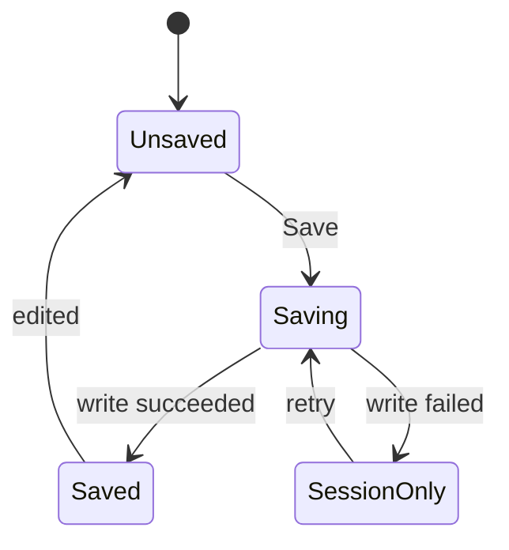

# عقود الشاشات والمكونات — EM Pocket

ملحق تنفيذي لـ[المواصفة الرئيسية](MASTER-DESIGN-SPEC.md). جميع التفاصيل هنا مقترحة للتنفيذ؛ لا تمثل تغييرًا أُجري على التطبيق. معرفات القبول ثابتة ليست أسماء classes إلزامية.

## A — قواعد مشتركة لا تتغير بين الشاشات

**A01 — ملكية الوجهة:** شريط التطبيق يملك وجهة واحدة نشطة. الموضوع السريري يفعّل Library، الحالة التعليمية Learn، وأي رسم/تسجيل ECG يفعّل ECG، والعرض المختصر Quick. يمكن أن يبقى Back إلى المصدر المختلف دون تغيير ملكية الوجهة.

**A02 — عناوين:** اسم الصفحة في المتصفح «اسم المحتوى · EM Pocket». يختلف عنوان dialog عن عنوان الصفحة. لا تبقى «Library» عند الدخول إلى حالة.

**A03 — نطاق العرض:** لا scroll أفقي للصفحة عند 320px. يسمح به داخل ECG والجدول الذي يحتاج بعدين فعلًا، مع اسم ووصف وحل وصول بديل. الأزرار تلتف بدل اختصار نصها الحرج.

**A04 — الحشو:** هاتف 16px، بطاقة 16px، فصل أقسام 24px؛ الشاشات 320–359 تستخدم هامش 12px. Desktop 24–32px وبطاقة 20–24px. لا double padding داخل بطاقة ثم داخل كل سطر.

**A05 — الرموز:** 20px بجوار الأفعال و 24px في التنقل. لا أيقونة جهاز كبيرة كزخرفة بكل بطاقة؛ badge صغيرة اختيارية. كل رمز مستقل له label، والزخرفي aria-hidden.

**A06 — كثافة القراءة:** فقرات منطقية متصلة. القوائم للخطوات أو العناصر المتوازية، لا تفكيك جملة سريرية إلى tokens متباعدة. جدول عند وجود مقارنة حقيقية؛ لا جدول لتزيين كل فقرة.

**A07 — الأرقام:** عدد دقيق من مصدر الحالة، tabular-nums للصفوف المتغيرة، وصفر واضح عند الحاجة. null يعرض «Not specified»، لا صفر. لا تقريب يغير المعنى.

**A08 — النص الطويل:** title يلتف، button ينمو رأسيًا، badge يلتف إن لزم، والشرح السريري لا line-clamp. يسمح clamp لوصف فهرس غير سريري كامل ومتاح بعد الفتح فقط.

**A09 — الحالات:** disabled لا يقلل مقروئية شرح طبي؛ يجري تعطيل الفعل دون طمس النص. busy يحتفظ بالاسم والعرض. نجاح الحفظ يحتاج نجاح كتابة حقيقي.

**A10 — عرض الهاتف الأفقي:** لا force orientation، ولا استبدال واجهة مختلفة غير قابلة للرجوع. أدوات ECG تلتف، ومساحة الرسم تستفيد من العرض مع بقاء زر الإغلاق.

**A11 — نمط الخط:** line-height أساسي 1.65، حد أدنى body 16px في الإعداد الافتراضي. كل text token يتبع مقياس المستخدم، مع اختبار عدم قص الرسم والوسوم.

**A12 — المحتوى الخارجي:** يظهر اسم المصدر ويفتح كرابط حقيقي. `target=_blank` مصحوب بوصف ملائم وrel آمن؛ في offline يوضح احتياجه إلى اتصال.

**A13 — الحالة المرئية:** اختيار زرين لا يعرض لونين كافيين وحدهما؛ selected له اسم/علامة وحالة متاحة. no hover-only instructions.

**A14 — القوائم المتعددة:** عند فتح Menu جديدة تغلق السابقة؛ لا overlays متداخلة إلا ضرورة صريحة. Escape يغلق الأعلى فقط ثم يعيد التركيز لمصدرها.

**A15 — أكواد ومصطلحات:** الاشتقاقات والوحدات والمعرفات LTR مستقلة داخل العربية، ولا عكس لزمن ECG. العنوان الإنجليزي الطبي يحتفظ باتجاهه.

## B — مواصفات الأبعاد لكل مكوّن

| ID | المكوّن | الأبعاد الأساسية | الحواف/الحشو | تفاصيل |
|---|---|---|---|---|
| C01 | زر أساسي | ارتفاع أدنى 48px | radius 10، padding 12×16 | نص 15–16px، أيقونة 20، gap 8 |
| C02 | زر ثانوي | ≥44px | نفس نظام الحواف | حد مقروء؛ لا ظل افتراضي |
| C03 | زر رمز | 44×44 أو 48×48 | radius 10 | مساحة الرمز لا تحدد مساحة اللمس |
| C04 | حقل بحث | ≥48px؛ عرض متاح | padding 12–16 | clear button ≥44px دون تغطية النص |
| C05 | بطاقة موضوع | ارتفاع تلقائي | radius 16، padding 16/20 | اسم 17–18px، وصف 14–15px، فصل 12 |
| C06 | بطاقة تعلم | ارتفاع تلقائي | مثل بطاقة الموضوع | نوع وحالة وفعل؛ لا عدد متضارب |
| C07 | شارة | ارتفاع تلقائي، min24px | radius 6، padding4×8 | نص 12px؛ ليست زرًا صغيرًا إذا تفاعلية |
| C08 | filter chip | min44px إذا تفاعلي | radius10، padding8×12 | selected واضح؛ أسماء لا تختفي |
| C09 | checkbox row | min48px | padding8×0 | مربع 20–22px وlabel واسع |
| C10 | accordion header | min52px | padding12–16 | heading وbutton يملآن العرض |
| C11 | feedback | ارتفاع تلقائي | radius12، padding16 | عنوان ثم سبب ثم روابط؛ لا fixed height |
| C12 | inline alert | ارتفاع تلقائي | padding12–16 | رمز 20، نص وفعل مستقل |
| C13 | toast | max420px Desktop | padding12×16 | الهاتف ضمن الهامش؛ فوق nav وبعيد عن keyboard |
| C14 | dialog | max560px | radius20، padding24 | max-height من viewport؛ scroll داخلي واحد |
| C15 | mobile sheet | كامل العرض/المساحة عند الحاجة | حواف أعلى 20 إذا جزئية | ليس ارتفاعًا ثابتًا يقطع المحتوى |
| C16 | topbar | min56px | padding مناسب للـsafe-area | يزيد ارتفاعه عند النص الكبير |
| C17 | bottom nav | min64px + inset | 4 خلايا متساوية | لا captions أصغر من 12px |
| C18 | desktop sidebar | 248px أو 80px | gap8، padding16 | أسماء واضحة/كشف مع labels لا tooltips فقط |
| C19 | contents rail | 200–220px | gap4–8 | يظهر فقط إن بقي عرض قراءة مناسب |
| C20 | ECG canvas | عرض مرن، نسبة renderer | viewport مستقل | لا فرض ارتفاع بطاقة يقص اشتقاقات |
| C21 | answer option | min56px | padding16، gap12 | letter badge اختياري ونص يلتف كاملًا |
| C22 | note textarea | min3 أسطر | padding12 | maxlength800؛ count/status خارج الحقل |
| C23 | progress bar | track6–8px | radius صغير | label «2 of3» مستقل؛ لا إطار زخرفي |
| C24 | menu item | min44px | padding12×16 | label واضح، حذف مدمر منفصل |
| C25 | table | عرض المحتوى/100% | cell padding12 | رؤوس وcaption عند الحاجة؛ overflow محلي |

## C — الألوان والحواف والظلال والحالات

- الخلفية Canvas هادئة، والبطاقة Surface. shadow واحد خفيف للبطاقات القابلة للرفع عند الحاجة؛ البطاقات داخل الموضوع تعتمد الفواصل والمسافات أكثر من الظلال.
- border structural نهاري `#D7E2DC` وليلي `#354B42` للزخرفة فقط. حدود inputs والتحكم الفعلي تستخدم زوجًا أوضح: `#698078` على الأبيض، و`#91A99F` على surface الليلي، وقد فحصت ضمن COLOR-CONTRAST.
- focus ring أخضر الهوية على surface نهاري، ومنت/فاتح على surface ليلي. إن كان الزر من اللون نفسه يضاف offset واضح يميزه عن المحيط.
- hover primary نهاري `#0F5549` وactive `#0B453B` مع أبيض؛ لا تخفيض opacity للزر كله. ألوان hover/active الليلية تُشتق وتُختبر قبل دمجها، ولا يُفترض نجاح كل color-mix.
- ظلال أولية: card `0 2px 8px rgb(17 45 35 / 5%)`، popover `0 8px 24px rgb(10 25 20 / 14%)`. في الليل ظل أقل اعتمادًا وحد مناسب؛ الألوان هي tokens لا literals متناثرة.
- لا ظلال على كل نص، ولا gradient خلف فقرات طبية، ولا خطوط رفيعة جدًا للإشارة العلمية.
- selected card لا تعني نشاطًا مكتملًا؛ يختلف selection عن completion في النص والرمز.
- Critical/Warning/Completed/Info لها foreground/background ثابتان مستقلان عن accent. حالات «incorrect» التعليمية لا توصف بأنها خطأ طبي ارتكبه المستخدم فعليًا.
- tooltip يظهر عند hover وfocus، مع تأخير قصير فقط للفأرة، ولا يحمل معلومة لازمة للتشغيل أو شرطًا سريريًا.
- كل theme/scale/bold/viewport داخل اختبار snapshot بصري؛ لا الاكتفاء بمظهر افتراضي واحد.

## D — انتقالات الحالة المعيارية

### D01 — الحفظ

يظل النص عند الفشل. لا spinner طويل على كتابة محلية؛ تعلن الحالة النصية بعد تحقق النتيجة. Save أثناء busy لا ينشئ عملية ثانية. Back يشرح الخسارة الفعلية إن وجدت.

### D02 — إجابة السؤال

Unanswered → Committed → Feedback → Next decision → Debrief. لا انتقال من Unanswered إلى Next بضغطة مضاعفة، ولا تغيير للاختيار بعد تسجيل first choice. Retry ينشئ attempt جديدة ولا يعيد وصف المحاولة السابقة كأنها لم تقع.

### D03 — تحميل رسم/تسجيل

Idle → Loading → Ready أوError. Retry من Error، وتغيير route يبطل النتيجة القديمة. spinner له اسم، والخطأ له عنوان ورابط عودة. لا waveform بديل يملأ مساحة الفشل بصمت.

### D04 — استيراد نسخة

No file → Validating → Preview أوRejected → Applying → Applied أوFailed/restored أوFailed/restoration incomplete. التطبيق لا يكتب أثناء Preview ولا يطبق ملفًا اختير لاحقًا إذا سبقه تحقق أبطأ لملف قديم.

### D05 — تحديث PWA

Current → Update found → Ready to refresh → Draft check → Defer أوRefresh → New current. خطأ التثبيت يبقي الحالة القديمة صريحة؛ لا يختفي شريط التحديث برسالة نجاح قبل تفعيل النسخة.

### D06 — البحث

Idle → Typing/composing → Results أوNo results أوIndex unavailable → Selected result → Section opened. فتح نتيجة يحفظ query/selection/scroll للرجوع. Clear query مختلف عن Reset library filters.

## E — نصوص الواجهة المرجعية

هذه نصوص إنجليزية مقترحة لأن المنتج الحالي إنجليزي. تُراجع لغويًا عند التنفيذ وتترجم ترجمة بشرية إن أضيفت العربية؛ لا تغيير للمحتوى الطبي لمجرد ملاءمة زر.

| الموضع | النص المقترح | القاعدة |
|---|---|---|
| بحث شامل | Search topics, findings or ECGs | النطاق الحقيقي شامل |
| نتائج كاملة | View all results | لا يَعِد بعدد لم يحسب |
| صفر نتائج | No results for “…” | الاستعلام escaped/plain text |
| إجراء صفر نتائج | Clear search / Browse library | طريقان واضحان |
| فلاتر | Filters · 2 active | العدد يعكس مجموعات/قيم محددة بعقد واحد |
| reset | Reset filters | لا يمسح التقدم |
| حفظ موضوع | Save topic / Saved | الاسم والحالة متطابقان |
| إزالة حفظ | Remove from saved | لا حذف موضوع أو note |
| استئناف مرحلة | Resume case · Decision 2 of3 | فقط إن محفوظة فعليًا |
| آخر موضوع | Recently opened | لا نسبة إنجاز مختلقة |
| مدة تقديرية | Estimated 5–8 min | بعد قياس مبدئي؛ لا countdown |
| مراجعة مجدولة | Due for review | مختلفة عن ضعف ثقة ذاتية |
| ضعف ثقة | Flagged for review | ليست موعدًا محسوبًا بلا بيانات |
| نتيجة تعلم | First choices in this attempt | ليست competency score |
| correct | Correct for this scenario | مع سبب وحدود |
| incorrect | Review this choice | مع شرح البديل |
| reveal | Reveal explanation | لا كشف تشخيص في اسم سابق مخفي |
| وحدة | Mark as read | لا «Skill completed» |
| ثقة ذاتية | Got it / Partly / Review again | توضيح Self-rated |
| note | Private study note | تخزين محلي |
| لم يحفظ | Unsaved changes | يبقى مرئيًا |
| حفظ ناجح | Saved on this device | بعد كتابة ناجحة |
| حفظ فشل | Available for this visit only | ليس «Saved» |
| نسخ ناجح | Reference template copied | لا يوحي بhandover مريض مكتمل |
| نسخ رفض | Clipboard unavailable — copy manually | textarea قابل للتحديد |
| offline pending | Offline setup pending | لا وعد مبكر |
| offline ready | Ready for offline use | بعد العامل والأصول المطلوبة |
| رابط مصدر | External source · internet required | عند offline أوفي help |
| تحديث | New version available | إجراء Refresh when ready |
| source date | Selected source checks: 8 Oct2026 | نطاق المراجعة لا اعتماد شامل |
| صناعي | Synthetic teaching model | ظاهر قرب الرسم |
| حقيقي | Recorded ECG · PTB-XL | يظهر المصدر والإصدار داخل details |
| تخطيطي | Schematic diagram | لا قياس فيزيائي مفترض |
| قيمة مجهولة | Not specified | null ليست صفرًا |
| Quick | Selected educational reference points | نطاق الملخص واضح |
| print | Print / Save as PDF | سلوك browser print الحقيقي |
| import | Add missing records | السلوك الحالي يحتفظ بالقيم الموجودة |
| رفض import | Unsupported backup format | لا كتابة جزئية |
| اتفاق | Accept & enter EM Pocket | فعل صريح بعد checkbox |
| About | Educational reference | لا اعتماد/تشخيص فردي |

## F — شاشة Library: العقد القابل للاختبار

**الدخول:** `./` أو`#library`، ومسار العودة من topic. لا تحميل للمكتبة الحقيقية ECG قبل طلبها.

**الصفوف:** header → title/search → system filters → result count/saved → topics → learning link. على 320px لا أيقونات تصنيف كبيرة ولا صف metadata مزدحم. Saved زر ثانوي مستقل عن عنوان نتيجة.

**الفلاتر المفصلة:** groups الأصلية + patient context: All/Pediatric/Pregnancy/Older adult/Immunocompromised/Trauma. أهمية التشخيصات All/Critical/Emergent/Common كما في المصدر، مع شرح أن الوصف للمحتوى. لا تعامل «Common» كأنها «Stable patient».

**حالة الرجوع:** يعود focus للعنوان أوالكارت الذي فتحه، مع نفس الفلاتر والموضع. تغيير الفلاتر يعلن count بعد الاستقرار، ولا يركز أعلى الصفحة كل مرة.

**قبول:** كل topic له card، ولا تكرار معرفات، ولا card تفاعلية داخل button أخرى، ولا فقد اسم بسبب line-clamp.

## G — شاشة Topic: خريطة التفاصيل

- عنوان ومصدر/تاريخ ومجال، ثم Save/Quick/More.
- القسم المستهدف بالرابط/البحث يفتح، ويُنقل focus إلى عنوانه، وباقي الأقسام تبقى قابلة للوصول.
- Accordion لا يعاد بناؤه عند ضغط Save. checkbox لا يسبب إعادة تصيير كاملة تفقد موضع القارئ.
- حقل ملاحظة أسفل منطقة تعلم واضحة؛ التنبيه الطبي ليس watermark على النص.
- جدول workup يحتوي عناوين مجموعات كاملة؛ عمود نص متعدد الأسطر أفضل من scroll إذا ليست هناك مقارنة ثنائية حقيقية.
- مصادر الروابط: اسم الجهة والوثيقة/السنة، حقل checked من المحتوى، وسطر limits. no auto-current-year update.
- See also يضم روابط ثابتة بالاسم الحقيقي، لا next عشوائي بحسب card index.
- نسخة Print تفتح كل الأقسام الطبية، وتستبعد notes/selection إن لم يختارهما المستخدم.

## H — Learn وProgress: ترتيب الأولوية

- New: تعريف مختصر + Start a short case + ECG basics + أنواع الأنشطة؛ لا سبع بطاقات صفر.
- Returning: Resume إن كان دقيقًا، ثم Due review، ثم أنواع الأنشطة، ثم مسار مقترح، ثم السجل.
- Completed all: «Revisit a case» و«Review saved findings»؛ لا «You mastered emergency medicine».
- Progress: مجموعات مستقلة للمواضيع/الحالات القصيرة إن توافرت بيانات محاولاتها/الحالات المتطورة/ECG/الوحدات. لا اختلاق counters للحالات القصيرة التي لا يخزن محركها نتائج إجابات دائمة.
- Backup داخل Progress، وبرابط ثانوي من Settings. preview يوضح التعارضات وعدد الأقسام دون عرض notes الخاصة كلها على شاشة عامة.
- مستوى التعلم control واحد مشترك، ليس selector يتكرر في كل بطاقة. شرح اختلاف prompts متاح بجانبه.

## I — Quick: عملية اعتماد الملخصات

1. استخراج حقول المصدر الحالية بلا تغيير النص.
2. تحديد نقاط ملخص لكل موضوع وسبب اختيارها.
3. التحقق من بقاء الاستثناءات والقيود والموانع مرتبطة بالنقطة المختصرة.
4. مراجعة بشرية سريرية للـ 45 ملخصًا، مع reviewer/date/scope إذا توفرت فعلًا.
5. إلى حين الاعتماد يُعرض النص الأصلي للقسم كاملًا تحت عنوانه؛ لا حذف باستعمال slice كافٍ لوحده.
6. اختبار روابط الملخص إلى original section، والنسخ والطباعة وحدود العرض.

لا تبني UX على توفر ملخصات أوجرعات أوscore calculators لم يراجعها أحد. غياب ملخص معتمد حالة محتوى معلومة، لا فراغ يملأه المطور بعلاج جديد.

## J — ECG: نقاط تدقيق قبل اعتماد أي تغيير بصري

- نفس مسارات الموجة عند نفس المدخلات قبل/بعد CSS.
- عرض كل lead label وعدم قص الصف الأخير أوsupplemental leads.
- المعايرة المعلنة توافق renderer؛ zoom لا يُسمى gain.
- لا تحويل SVG إلى bitmap منخفض الدقة للنسخة المكبرة أوالطباعة.
- العلامات على الرسم نفسه، وتوافق جميع targets في الحالات الـ 69.
- أسماء SVG فريدة في original/reference/fullscreen معًا.
- أصلي ومقارنة لا يستخدمان نفس IDs حتى لو كانا في DOM مختلف شكليًا داخل page واحدة.
- المقارنة reference synthetic لا يُسمى «Previous ECG».
- Practice لا يسرب جوابًا في alt/title/heading/selector عند الإخفاء المقصود؛ البديل النصي يصف الشكل والمهمة دون إفسادها.
- full12-lead وfocused strip ليسا قابلين للتبادل دون تسمية؛ لا 12-lead مزعوم من leads مركبة غير مدعومة.
- بيانات التسجيلات وأرقامها وsource statements وlikelihood null محفوظة.
- الرسم في الوضع الليلي لا يبدل الإشارة إلى لون يختفي فوق الورقة.
- القياس بضوابط أصلية/keyboard، ومؤشرات المنطقة يمكن اختيارها من قائمة نصية.
- يراجع normal/Wellens A/B/posterior/Brugada/TCA/arrhythmias وأقصى ارتفاع/عرض ومختلف تنسيقات المكتبة بصريًا، مع فحص آلي لكل المعرفات.

## K — Settings وNotice وData: قرارات دقيقة

Settings صفحة قابلة للرابط، وتستخدم sheet فقط كتقديم responsive لها؛ Back/Escape يعودان لمصدر صحيح. معاينة Reading فقرة ثابتة قصيرة دون حالة مريض أوجرعة تتغير.

Accent يحتفظ بالمعرفات الستة القديمة. معاينة اللون لا تغير critical/warning. اختيار dark يحدّث native color-scheme وtheme-color ضمن نفس العملية، مع اختبار عدم flash أثناء startup.

Notice الأول لا يعتبر checkbox focus أوضغط Escape اتفاقًا. في review mode يظل القبول القديم محترمًا؛ لا طلب موافقة متكرر بسبب تغيير CSS. الاختبارات لا تضغط Accept نيابة عن المستخدم، وتعزل عرضها في DOM مؤقت دون كتابة مفتاح الاتفاق.

Data controls لا تُدخل عملية reset شاملة ضمن تفضيل لون. إزالة محددة: اختيار نطاق → عدد/وصف ما سيحذف → confirmation باسم الفعل → نتيجة. لا مسح cache أوبيانات paid أواتفاق إلا طلب منفصل صريح يحدد هذا النطاق، ولا يلزم تقديم هذه العملية ضمن إصدار إعادة التصميم الأول.

## L — مواصفات التقييم والقرارات المفتوحة المحدودة

قرارات التصميم الأساسية محسومة في الوثيقة. تبقى التفاصيل التالية للتحقق التجريبي، ولا تُترك فارغة لتمنع بدء النموذج:

| القرار | الافتراضي المقترح | طريقة الحسم |
|---|---|---|
| موضع Contents | صف قصير على الهاتف، rail Desktop إن اتسع | اختبار الوصول إلى قسم غير أول |
| أحجام الخط/المسافات | tokens المذكورة | قارئ سريع ومتعلم مع text scaling |
| العناوين الإنجليزية الأربعة | Library/Learn/ECG/Quick | فهم معنى الوجهة دون شرح طويل |
| وحدات القراءة مقابل accordion | critical مفتوح، secondary مطوي جزئيًا | اكتشاف المعلومات والبحث والطباعة |
| استئناف short cases دائم | غير موعود في الإصدار الأول | تصميم schema/backup منفصل إذا ثبتت الحاجة |
| نسبة CSS المنخفضة | ميزانية مقاسة لا نسبة 60% ثابتة | bytes gzip/style conflicts/الأداء |
| مدة الأنشطة | لا مدة قبل قياس | تجربة فعلية مع range موسوم Estimated |
| قياس الاستبقاء | بلا tracking تلقائي جديد | دراسة اختيارية وموافقة ونطاق محدد |
| لغة عربية للمنتج | تهيئة RTL دون ترجمة طبية تلقائية | مشروع ترجمة ومراجعة بشرية منفصل |

جلسة تقييم مقترحة: 5–8 مشاركين متنوعي الخبرة في جولة أولية، ثم جولة ثانية بعد الإصلاح؛ هذا حجم بحث نوعي مقترح لا عينة إحصائية لإثبات مضاعفة الاستبقاء. مهام: العثور على قسم، العودة لنتيجة بحث، استئناف حالة، قراءة ECG مع finding، حفظ note، فتح مصدر، استخدام offline، وطباعة نطاق صحيح. يسجل الإكمال والخطأ والتردد والزمن وملاحظات المشارك، دون بيانات مرضى.

## M — قائمة إغلاق مهمة تنفيذية صغيرة

قبل إغلاق أي مهمة UI: مكوّن/شاشة محددان، وسلوك قبل/بعد، حالات فشل، دعم keyboard، نطاق عرض ضيق، مظهر ليلي، تكبير نص، طباعة إن كانت معنية، scope تخزين، اختبار مناسب، لقطة ومراجعة بصرية، release token إذا تغير أصل منشور، وتقرير صادق لما لم يُفحص. هذه قائمة عمل داخلية؛ لا تُعرض للمستخدم النهائي داخل المنتج.
