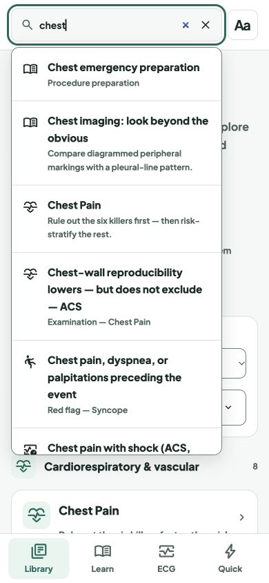
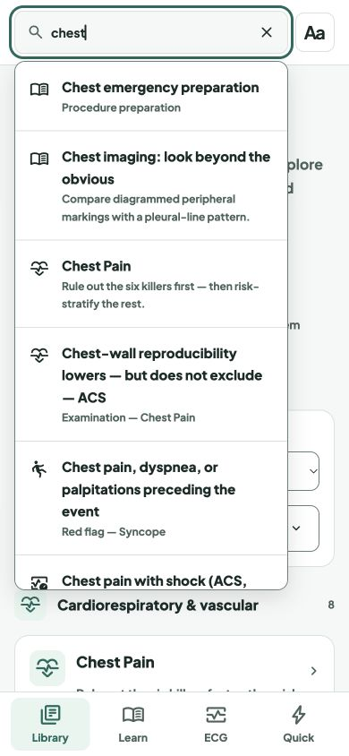

# One clear action in the header search

Release: `20261008-search-clear-v39` · scoped service-worker cache `v236`.

The browser's native search cancel control appeared beside the app's clear button, showing two adjacent × icons in a populated field. A CSS rule now hides the native duplicate. The search input retains its `type="search"` and combobox semantics; the existing labelled 44 × 44px button remains the clear action.

Local in-app browser review at 390 × 844 and 1280 × 800 confirmed one visible clear icon, clearing by click and keyboard (Tab, Enter), dismissal of results, and focus returning to the input. No browser errors were logged. `node --test tests/*.test.js`: 206 passed, no failures or skips. `git diff --check` passed. These were browser viewport checks, not physical-device tests.

Before:

After:

