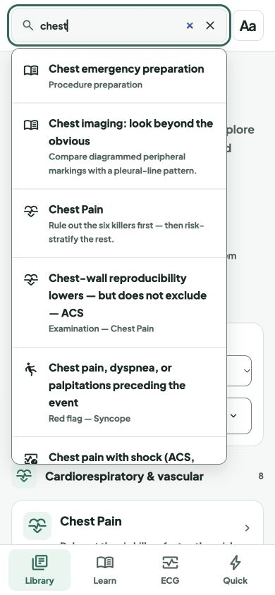

# Restore results when returning to search

Release: `20261008-search-refocus-v38` · scoped service-worker cache `v235`.

Previously, leaving the header search field hid its results but retained the query. Returning to that field left the results closed until the user edited the text. Focusing a retained query now reruns the existing search immediately, resets the previous result selection and keeps the current page in place. Empty or one-character queries do not open results, and modal dialogs retain focus ownership.

The regression test reproduced the failure before the fix. Validation after the fix: `node --test tests/*.test.js` (206 passed, no failures or skips), JavaScript syntax and diff checks, and local in-app browser checks on desktop and a 390 × 844 phone viewport. No physical-device testing was performed.

